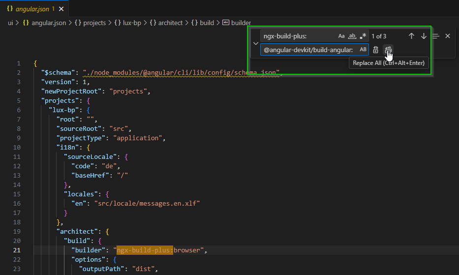

# Update Guide 19

In diesem Update Guide wird beschrieben, wie man die LUX-Components aktualisieren kann. Es handelt sich um inkrementelle Updates. D.h. alle Updates müssen in der korrekten Reihenfolge (Beispiel: 19.0.0 -> 19.0.1 -> 19.1.0 -> 19.1.1 ->...) ausgeführt werden und es darf kein Update übersprungen werden, da jedes Update neben der Versionsaktualisierung in der `package.json` auch potenziell weitere wichtige Änderungen enthalten kann, die sonst fehlen würden.

- [Update Guide 19](#update-guide-19)
  - [Änderungen](#änderungen)
  - [Versionen](#versionen)
    - [Version 19.5.0](#version-1950)
    - [Version 19.4.0](#version-1940)
      - [Wichtiger Hinweis - schnittstellenbrechende Änderung](#wichtiger-hinweis---schnittstellenbrechende-änderung)
    - [Version 19.3.0](#version-1930)
    - [Version 19.2.0](#version-1920)
    - [Version 19.1.0](#version-1910)
    - [Version 19.0.0](#version-1900)
      - [Allgemein](#allgemein)
      - [Vor dem Update](#vor-dem-update)
      - [Update](#update)
      - [Nach dem Update](#nach-dem-update)
      - [Troubleshooting](#troubleshooting)
      - [Ergänzung für JAST-Projekte](#ergänzung-für-jast-projekte)
      - [Weiterführende Verweise bei Interesse oder Problemen](#weiterführende-verweise-bei-interesse-oder-problemen)
      - [Erklärung](#erklärung)

## Änderungen

**Wichtig!** Bitte alle Änderungen in der [CHANGELOG.md](https://github.com/IHK-GfI/lux-components-workspace/blob/main/projects/lux-components-lib/CHANGELOG.md) durchlesen.

## Versionen

In diesem Abschnitt wird beschrieben, wie man die LUX-Components aktualisieren kann. Alle Updates sind inkrementelle Updates. D.h. alle Updates müssen in der korrekten Reihenfolge ausgeführt werden und **_es darf kein Update übersprungen werden_**, da jedes Update, neben der Versionsaktualisierung in der `package.json`, auch potenziell weitere wichtige Änderungen enthalten kann, die sonst fehlen würden.

### Version 19.5.0

In diesem Abschnitt wird beschrieben, wie man die LUX-Components aktualisieren kann. Alle Updates sind inkrementelle Updates. D.h. alle Updates müssen in der korrekten Reihenfolge ausgeführt werden und **es darf kein Update übersprungen werden**, da jedes Update, neben der Versionsaktualisierung in der `package.json`, auch potenziell weitere wichtige Änderungen enthalten kann, die sonst fehlen würden.

- LUX-Components-Updater aktualisieren:
  - `npm update @ihk-gfi/lux-components-update`
- LUX-Components-Updater ausführen:
  - `ng generate @ihk-gfi/lux-components-update:update-19.5.0`
- Wenn Probleme beim Ausführen von `npm install` mit den Abhängigkeiten (z.B. `@angular-devkit/build-angular`,...) auftreten sollten, bitte einmal den `node_modules`-Ordner und die `package-lock.json`-Datei löschen und noch einmal `npm install` ausführen.
- Fertig!

### Version 19.4.0

In diesem Abschnitt wird beschrieben, wie man die LUX-Components aktualisieren kann. Alle Updates sind inkrementelle Updates. D.h. alle Updates müssen in der korrekten Reihenfolge ausgeführt werden und **es darf kein Update übersprungen werden**, da jedes Update, neben der Versionsaktualisierung in der `package.json`, auch potenziell weitere wichtige Änderungen enthalten kann, die sonst fehlen würden.

- LUX-Components-Updater aktualisieren:
  - `npm update @ihk-gfi/lux-components-update`
- LUX-Components-Updater ausführen:
  - `ng generate @ihk-gfi/lux-components-update:update-19.4.0`
- Wenn Probleme beim Ausführen von `npm install` mit den Abhängigkeiten (z.B. `@angular-devkit/build-angular`,...) auftreten sollten, bitte einmal den `node_modules`-Ordner und die `package-lock.json`-Datei löschen und noch einmal `npm install` ausführen.
- Fertig!

#### Wichtiger Hinweis - schnittstellenbrechende Änderung

> Die Filterkomponente wurde in Version 19.4.0 optisch überarbeitet. Die Anpassung beeinflusst bestehende Layouts und ist deshalb schnittstellenbrechend.
> Solche Änderungen erfolgen normalerweise nur in einem Hauptrelease, wurden hier jedoch aus Gründen der Barrierefreiheit vorgezogen (siehe [Issue #93](https://github.com/IHK-GfI/lux-components-workspace/issues/93)).

### Version 19.3.0

In diesem Abschnitt wird beschrieben, wie man die LUX-Components aktualisieren kann. Alle Updates sind inkrementelle Updates. D.h. alle Updates müssen in der korrekten Reihenfolge ausgeführt werden und **es darf kein Update übersprungen werden**, da jedes Update, neben der Versionsaktualisierung in der `package.json`, auch potenziell weitere wichtige Änderungen enthalten kann, die sonst fehlen würden.

- LUX-Components-Updater aktualisieren:
  - `npm update @ihk-gfi/lux-components-update`
- LUX-Components-Updater ausführen:
  - `ng generate @ihk-gfi/lux-components-update:update-19.3.0`
- Wenn Probleme beim Ausführen von `npm install` mit den Abhängigkeiten (z.B. `@angular-devkit/build-angular`,...) auftreten sollten, bitte einmal den `node_modules`-Ordner und die `package-lock.json`-Datei löschen und noch einmal `npm install` ausführen.
- Fertig!

### Version 19.2.0

In diesem Abschnitt wird beschrieben, wie man die LUX-Components aktualisieren kann. Alle Updates sind inkrementelle Updates. D.h. alle Updates müssen in der korrekten Reihenfolge ausgeführt werden und **es darf kein Update übersprungen werden**, da jedes Update, neben der Versionsaktualisierung in der `package.json`, auch potenziell weitere wichtige Änderungen enthalten kann, die sonst fehlen würden.

- LUX-Components-Updater aktualisieren:
  - `npm update @ihk-gfi/lux-components-update`
- LUX-Components-Updater ausführen:
  - `ng generate @ihk-gfi/lux-components-update:update-19.2.0`
- Wenn Probleme beim Ausführen von `npm install` mit den Abhängigkeiten (z.B. `@angular-devkit/build-angular`,...) auftreten sollten, bitte einmal den `node_modules`-Ordner und die `package-lock.json`-Datei löschen und noch einmal `npm install` ausführen.
- Fertig!

### Version 19.1.0

In diesem Abschnitt wird beschrieben, wie man die LUX-Components aktualisieren kann. Alle Updates sind inkrementelle Updates. D.h. alle Updates müssen in der korrekten Reihenfolge ausgeführt werden und **es darf kein Update übersprungen werden**, da jedes Update, neben der Versionsaktualisierung in der `package.json`, auch potenziell weitere wichtige Änderungen enthalten kann, die sonst fehlen würden.

- LUX-Components-Updater aktualisieren:
  - `npm update @ihk-gfi/lux-components-update`
- LUX-Components-Updater ausführen:
  - `ng generate @ihk-gfi/lux-components-update:update-19.1.0`
- Wenn Probleme beim Ausführen von `npm install` mit den Abhängigkeiten (z.B. `@angular-devkit/build-angular`,...) auftreten sollten, bitte einmal den `node_modules`-Ordner und die `package-lock.json`-Datei löschen und noch einmal `npm install` ausführen.
- Fertig!

### Version 19.0.0

#### Allgemein

Bitte zuerst die vollständige Anleitung lesen und danach mit dem Update beginnen. Das Update sollte auf einem separaten Branch durchgeführt werden und nicht direkt auf dem Develop-Branch.

#### Vor dem Update

1. **Wichtig!** Bitte alle Änderungen in der [CHANGELOG.md](https://github.com/IHK-GfI/lux-components-workspace/blob/main/projects/lux-components-lib/CHANGELOG.md) durchlesen.
1. LUX-Components auf die letzte Version `18.x.x` (siehe [Version 18.x.x](update-guide-v19)) aktualisieren.
1. Node auf 18, 20 oder 22 (empfohlen) aktualisieren (siehe auch [Ergänzung für JAST-Projekte](#ergänzung-für-jast-projekte)).<br>

#### Update

1. `npm install -g @angular/cli@19`

1. Die Datei _package-lock.json_ löschen.

1. Die Abhängigkeit _ngx-cookie-service_ in der _package.json_ auf die Version _19.0.0_ setzen, aber **ohne** ein `npm install` auszuführen.

1. In der Datei _angular.json_ alle Vorkommen von _ngx-build-plus:_ in _@angular-devkit/build-angular:_ ersetzen.

   

1. Angular auf 19 aktualisieren:

   `ng update @angular/core@19 @angular/cli@19 --allow-dirty --force`

   Die Rückfrage nach dem _use-application-builder_ bestätigen.
   
   Die Rückfrage nach dem _provide-initializer_ bestätigen.
   

   `ng update @angular/cdk@19 @angular/material@19 @angular-eslint/schematics@19 --allow-dirty --force`

1. LUX-Components-Updater aktualisieren:

   `npm install @ihk-gfi/lux-components-update@19 --save-dev --force`

1. Updater ausführen:

   `ng g @ihk-gfi/lux-components-update:update-19.0.0`

1. Imports anpassen:

   `ng g @ihk-gfi/lux-components-update:update-standalone-imports`

   _**Wichtig! Falls es in den Testfällen (*.spec.ts) individuelle Components gibt, müssen diese manuell angepasst werden. Das Update-Skript kann dabei nicht unterstützen.**_

1. Die Datei _package-lock.json_ und den Ordner _node_modules_ löschen.

1. Allen runden Buttons (_<lux-button [luxRounded]="true"..._) muss manuell ein aussagekräftiges Label (_luxLabel="xxx"_) gegeben werden, das als Aria-Label für die Barrierfreiheit verwendet werden kann.

1. Abhängigkeiten aktualisieren:

    `npm install`

1. (Optional): Die deutschen Übersetzungen der LUX-Components im Projekt aktualisieren:

    `npm run xi18n`

1. (Optional): Die englischen Übersetzungen der LUX-Components im Projekt aktualisieren:

    `ng g @ihk-gfi/lux-components-update:update-en-messages`

1. Fertig!

#### Nach dem Update

- In der Datei _eslint.config.js_ sind Regeln für die Benennung von Componenten definiert. Der Standardpräfix lautet _app_. D.h. wenn man im Projekt einen individuellen Präfix verwendet, kann dieser in die _eslint.config.js_ übernommen werden. Es müssen nicht alle Komponenten umbenannt werden.
- Falls es eigene Abhängigkeiten im Projekt gibt, die nicht über den LUX-Components-Updater aktualisiert wurden, sollten diese jetzt ebenfalls aktualisiert werden.
- Einen Smoketest (build, lint und test) ausführen:

  `npm run smoketest`

- Folgende optionale Schematics können ausgeführt werden:
  - `ng generate @angular/core:standalone-migration` (Umstellung auf die neuen Standalone-Components)
  - `ng generate @angular/core:inject-migration` (Umstellung auf die inject-Funktion, anstatt Konstruktor-Injektion)
  - `ng generate @angular/core:route-lazy-loading` (Umstellung der Route auf Lazy Loading)
  - `ng generate @angular/core:cleanup-unused-imports` (Importe aufräumen)
- Anwendung vollständig testen.
- Fertig!

#### Troubleshooting

- JAST-Projekte: Wenn die Fehlermeldung _java.lang.StackOverflowError_ im zentralen Build erscheint, könnte es daran liegen, dass das Skript _move-de-files.js_ die Dateien aus dem _de_-Ordner nicht in den Root-Ordner kopiert.
- Wenn der Fehler `Can't find stylesheet to import` beim Importieren von SCSS-Dateien aus dem `node_module`-Ordner auftritt, bitte den folgenden Abschnitt in der _angular.json_ unterhalb von `"styles": ["src/styles.scss"],` hinzufügen:

  ```json
  "stylePreprocessorOptions": {
     "includePaths": ["node_modules/"]
   }
  ```

- Falls beim Lint-Aufruf (`npm run lint`) der Fehler `1:1  error  Definition for rule 'jsdoc/newline-after-description' was not found  jsdoc/newline-after-description` auftritt, dann ändert den Wert `jsdoc/newline-after-description` zu `off` in der _.eslintrc.json_.
- Falls noch _entryComponents_ im Projekt vorhanden sind, können diese bedenkenlos gelöscht werden.
- Die Meldung `Could not find Angular Material core theme. Most Material...` in der Browser-Console kann ignoriert werden. Das Theme ist ausgelagert, funktioniert aber tadellos. Nur der Checker erkennt das leider nicht und schreibt diese Warnung in die Browser-Console raus.
- Sollte die Fehlermeldung `Error: PostCSS received undefined instead of CSS string` auftreten, dann gibt es einen leeren Styles-Eintrag (styles: [''] bzw. styles: [""]) in einer Komponente (im @Component-Block einer TypeScript-Datei). Einfach danach suchen und löschen.
- Die Meldung `Type '""' is not assignable to type 'LuxThemePalette'.` kann behoben werden, in dem man `''` durch `undefined` ersetzt. Der Leerstring ist kein gültiger Wert von `LuxThemePalette`.
- JAST-Projekte: Falls der zentrale Build mit der folgenden Fehlermeldung abbricht: `npm error /workspace/source/ui/node_modules/node-gyp-build-optional-packages/node-gyp-build.js`, bitte die Node-Version hochziehen und den Parameter _--no-optional_ entfernen (siehe [Ergänzung für JAST-Projekte](#ergänzung-für-jast-projekte)).

#### Ergänzung für JAST-Projekte

- Falls eine neue Node-Version installiert wurde, muss diese auch in die zentralen Builds eingetragen werden.<br>
  D.h. in der _pipeline.yaml_ muss z.B. von _node:18-alpine_ auf _node:22-alpine_ umgestellt werden.
- Bei der Umstellung auf eine neuere Node-Version sollte der Parameter _--no-optional_ aus der _pipeline.yaml_ entfernt werden.
- Bitte die _CSP_-Abschnitte in den Dateien _application-xxx.yml_ im _UI-Service_ anpassen.

#### Weiterführende Verweise bei Interesse oder Problemen

- [Angular Update Guide von v18 nach v19](https://angular.dev/update-guide?v=18.0-19.0&l=3)
- [Angular application build system](https://angular.dev/tools/cli/build-system-migration)

#### Erklärung

Die Angular-Updater installieren immer die aktuellsten Versionen. D.h. wenn eine neue Angular-Version erscheint und der LUX-Components-Updater noch nicht angepasst wurde, dann kommt es dazu, dass der LUX-Components-Updater eine ältere Version installieren möchte. Das scheitert an der `package-lock.json`, weil dort die neueren Versionen bereits festgelegt sind. Aus diesem Grund wird hier die Option `--force` angegeben.
