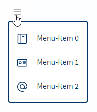
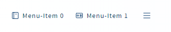
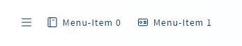
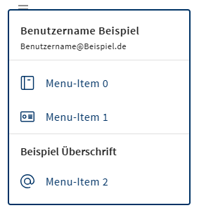

# LUX-Menu


- [LUX-Menu](#lux-menu)
  - [Overview / API](#overview--api)
    - [Allgemein](#allgemein)
    - [@Input](#input)
  - [Components](#components)
    - [LuxMenuItemComponent](#luxmenuitemcomponent)
      - [@Input](#input-1)
      - [@Output](#output)
  - [Beispiele](#beispiele)
    - [1. Einfaches Menü](#1-einfaches-menü)
    - [2. Extendedmenü (linksbündig)](#2-extendedmenü-linksbündig)
    - [3. Extendedmenü (rechtsbündig)](#3-extendedmenü-rechtsbündig)
  - [Zusatzinformationen](#zusatzinformationen)
    - [Konfigurationsoptionen](#konfigurationsoptionen)

## Overview / API

### Allgemein

| Name     | Beschreibung |
| -------- | ------------ |
| Selector | lux-menu     |

### @Input

| Name                        | Typ                     | Beschreibung                                                                                                                                                                                                                                                                                                                                       |
| --------------------------- | ----------------------- | -------------------------------------------------------------------------------------------------------------------------------------------------------------------------------------------------------------------------------------------------------------------------------------------------------------------------------------------------- |
| luxMenuIconName             | string                  | Ein Iconname (z.B. "lux-interface-user-single").                                                                                                                                                                                                                                                                                                   |
| luxTagId                    | string                  | [LUX-Tag-Id](luxTagId-v19#direkte-konfiguration) für die automatischen Tests.                                                                                                                                                                                                                                                                      |
| luxDisplayMenuLeft          | boolean                 | Bestimmt ob das ausgeklappte Menu links bzw. rechts von der (optionalen) horizontalen Navigation dargestellt wird.                                                                                                                                                                                                                                 |
| luxDisplayExtended          | boolean                 | Bestimmt ob nicht nur das normale Menu (ausklappbar über einen Button), sondern auch eine horizontale Navigation angeboten wird.                                                                                                                                                                                                                   |
| luxMaximumExtended          | number                  | Bestimmt wie viele Elemente maximal in der horizontalen Navigation dargestellt werden können.                                                                                                                                                                                                                                                      |
| luxMenuItems                | LuxMenuItemComponents[] | Ein Array mit LuxMenuItemComponents, welche dann dargestellt werden. Entspricht einer alternativen Darstellungsweise, wenn über 2 Unterkomponenten hinweg Content-Projection stattfindet.                                                                                                                                                          |
| luxClassName                | string                  | Ermöglicht es, dem Menu eigene CSS-Klassen mitzugeben (nützlich, wenn man das Styling nachträglich anpassen möchte).                                                                                                                                                                                                                               |
| luxHidden                   | boolean                 | Gibt an, ob ein Menüitem ausgeblendet werden soll.                                                                                                                                                                                                                                                                                                 |
| luxAriaMenuTriggerLabel     | string                  | Arialabel für den Menütriggerbutton.                                                                                                                                                                                                                                                                                                               |
| luxMenuLabel                | string                  | Label für den Menütriggerbutton. Tipp, man kann das Icon mit 'luxMenuIconName=""' ausblenden, damit nur das Label sichtbar ist.                                                                                                                                                                                                                    |
| luxMenuTriggerIconShowRight | boolean                 |                                                                                                                                                                                                                                                                                                                                                    |
| luxMenuItemFixWidth         | number                  | Über diese Property kann die Menüitembreite fix gesetzt werden. Normalerweise wird die Breite dynamisch berechnet, aber wenn z.B. das Menü ausschließlich aus einheitlichen Buttons besteht, kann man die Berechnung einsparen.                                                                                                                    |
| luxShowSections             | boolean                 | Diese Property gibt an ob in dem Menü LuxDivider und Überschriften angezeigt werden können. Dafür muss die Property luxDisplayExtended auf False gesetzt werden. Das Menü unterstützt nicht eine horizontale Navigation außerhalb des Panels. Damit die einzelnen Elemente angezeigt werden muss an jedes Element #menuSection hinzugefügt werden. |
| luxMenuPanelLarge           | boolean                 | Über diese Property kann die Darstellung des Menü-Panels geändert werden. Dies funktioniert jedoch nur wenn luxShowSections auf true gesetzt wird. Die Icons werden größer angezeigt und die MenüItems können eine zweite Unterzeile haben. Damit die einzelnen Elemente angezeigt werden muss an jedes Element #menuSection hinzugefügt werden.   |

## Components

### LuxMenuItemComponent

#### @Input

| Name                   | Typ             | Beschreibung                                                                                                                                                                                     |
| ---------------------- | --------------- | ------------------------------------------------------------------------------------------------------------------------------------------------------------------------------------------------ |
| lux-menu-item          | Selector        | Selector                                                                                                                                                                                         |
| luxAlwaysVisible       | boolean         | Bestimmt dass das Element unabhängig von Weight-Wert, maximal-erlaubten Elementen und Screen-Size in der horizontalen Navigation dargestellt werden soll.                                        |
| luxHideLabelIfExtended | boolean         | Über dieses Flag ist es möglich das Label des MenuItems im "ausgeklappten" Zustand zu verstecken.                                                                                                |
| luxLabel               | string          | Bestimmt das Label, welches in dieser Component angezeigt werden soll.                                                                                                                           |
| luxColor               | LuxThemePalette | Diese Property definiert die Farben der Component.                                                                                                                                               |
| luxRaised              | boolean         | Gibt an, ob der Button hervorgehoben wird.                                                                                                                                                       |
| luxIconName            | string          | Ein LUX-Iconname.                                                                                                                                                                                |
| luxTagId               | string          | [LUX-Tag-Id](luxTagId-v19#direkte-konfiguration) für die automatischen Tests.                                                                                                                    |
| luxDisabled            | boolean         | Gibt an, ob das Element deaktiviert ist.                                                                                                                                                         |
| luxRounded             | boolean         | Gibt an, ob ein runder Button verwendet werden soll.                                                                                                                                             |
| luxIconAlignWithLabel  | boolean         | Entfernt die vertikale Zentrierung des Icons, so dass es mit dem Label ausgerichtet ist.                                                                                                         |
| luxButtonTooltip       | string          | Tooltip für das Element. Der Tooltip wird aber nur angezeigt, wenn das Element als Button außerhalb des Menüs dargestellt wird.                                                                  |
| luxMenuTooltip         | string          | Tooltip für das Element. Der Tooltip wird aber nur angezeigt, wenn das Element als Button innerhalb des Menüs dargestellt wird.                                                                  |
| luxPrio                | number          | Über die Priorität kann die Anzeigereihenfolge beeinflusst werden.                                                                                                                               |
| luxButtonBadge         | string          | Text der in einer Badge hinter dem Label in einem Lux-Button angezeigt werden kann. Die maximale Länge beträgt vier Zeichen und wird bei Überlänge automatisch mit Ellipsis '...' abgeschnitten. |
| luxButtonBadgeColor    | LuxThemePalette | Farbe der ButtonBadge, die analog zur Button-Farbe gewählt werden kann. Mögliche Werte: "primary", "accent", "warn".                                                                             |
| luxMenuItemSubtitle    | string          | Wenn im Menü die Properties luxMenuPanelLarge und luxShowSections auf true stehen, wird der Text in einer zweiten Zeile angezeigt.                                                               |
| luxMenuItemSelected    | boolean         | Wenn im Menü die Property luxShowSections auf true steht, kann ein MenuItem als ausgewählt angezeigt werden.                                                                                     |

#### @Output

| Name       | Typ                   | Beschreibung                                                                                          |
| ---------- | --------------------- | ----------------------------------------------------------------------------------------------------- |
| luxClicked | EventEmitter \<Event> | Event welches beim Klick auf den Button ausgelöst wird und einen Clicked-Event als Parameter enthält. |

### LuxMenuPanelHeaderComponent

Diese Komponente funktioniert nur im Zusammenhang mit luxShowSelections.

| Name     | Beschreibung          |
| -------- | --------------------- |
| Selector | lux-menu-panel-header |

#### @Input

| Name        | Typ    | Beschreibung                                                                                                                                       |
| ----------- | ------ | -------------------------------------------------------------------------------------------------------------------------------------------------- |
| luxTitle    | string | Der Text der als Überschrift (z.B. der Benutzername) angezeigt werden soll. Das Element wird nur angezeigt wenn es im Menü an erster Stelle steht. |
| luxSubtitle | string | Text der unter der Überschrift steht (z.B. Email des Users).                                                                                       |

### LuxMenuSectionTitleComponent

Diese Komponente funktioniert nur im Zusammenhang mit luxShowSelections.

| Name     | Beschreibung           |
| -------- | ---------------------- |
| Selector | lux-menu-section-title |

#### @Input

| Name     | Typ    | Beschreibung                                        |
| -------- | ------ | --------------------------------------------------- |
| luxTitle | string | Der Text der als Überschrift angezeigt werden soll. |

## Beispiele

### 1. Einfaches Menü



Ts

```typescript
log(msg: string) {
    console.log(msg);
}
```

Html

```html
<lux-menu luxIconName="lux-interface-setting-menu-1" [luxDisplayExtended]="false">
  <lux-menu-item luxLabel="Menu-Item 0" luxIconName="lux-phone-book" (luxClicked)="log('Item 0 click')"></lux-menu-item>
  <lux-menu-item luxLabel="Menu-Item 1" luxIconName="lux-card" (luxClicked)="log('Item 1 click')"></lux-menu-item>
  <lux-menu-item luxLabel="Menu-Item 2" luxIconName="lux-mail-sign-at" (luxClicked)="log('Item 2 click')"></lux-menu-item>
</lux-menu>
```

### 2. Extendedmenü (linksbündig)



Ts

```typescript
log(msg: string) {
    console.log(msg);
}
```

Html

```html
<lux-menu luxIconName="lux-interface-setting-menu-1" [luxDisplayExtended]="true" [luxDisplayMenuLeft]="true" [luxMaximumExtended]="2">
  <lux-menu-item luxLabel="Menu-Item 0" luxIconName="lux-phone-book" (luxClicked)="log('Item 0 click')"></lux-menu-item>
  <lux-menu-item luxLabel="Menu-Item 1" luxIconName="lux-card" (luxClicked)="log('Item 1 click')"></lux-menu-item>
  <lux-menu-item luxLabel="Menu-Item 2" luxIconName="lux-mail-sign-at" (luxClicked)="log('Item 2 click')"></lux-menu-item>
</lux-menu>
```

### 3. Extendedmenü (rechtsbündig)



Ts

```typescript
log(msg: string) {
    console.log(msg);
}
```

Html

```html
<lux-menu luxIconName="lux-interface-setting-menu-1" [luxDisplayExtended]="true" [luxDisplayMenuLeft]="false" [luxMaximumExtended]="2">
  <lux-menu-item luxLabel="Menu-Item 0" luxIconName="lux-phone-book" (luxClicked)="log('Item 0 click')"></lux-menu-item>
  <lux-menu-item luxLabel="Menu-Item 1" luxIconName="lux-card" (luxClicked)="log('Item 1 click')"></lux-menu-item>
  <lux-menu-item luxLabel="Menu-Item 2" luxIconName="lux-mail-sign-at" (luxClicked)="log('Item 2 click')"></lux-menu-item>
</lux-menu>
```

### 4. Das neue Menü mit Sectionen



Ts

```typescript
log(msg: string) {
    console.log(msg);
}
```

Html

```html
<lux-menu luxIconName="lux-interface-setting-menu-1" [luxDisplayExtended]="false" [luxShowSections]="true">
  <lux-menu-panel-header luxTitle="Benutzername Beispiel" luxSubtitle="Benutzername@Beispiel.de" #menuSection></lux-menu-panel-header>
  <lux-divider #menuSection></lux-divider>
  <lux-menu-item luxLabel="Menu-Item 0" luxIconName="lux-phone-book" (luxClicked)="logIt('Item 0 click')" #menuSection></lux-menu-item>
  <lux-menu-item luxLabel="Menu-Item 1" luxIconName="lux-card" (luxClicked)="logIt('Item 1 click')" #menuSection></lux-menu-item>
  <lux-divider #menuSection></lux-divider>
  <lux-menu-section-title luxTitle="Beispiel Überschrift" #menuSection></lux-menu-section-title>
  <lux-menu-item luxLabel="Menu-Item 2" luxIconName="lux-mail-sign-at" (luxClicked)="logIt('Item 2 click')" #menuSection></lux-menu-item>
</lux-menu>
```

### 5. Das neue große Menü mit Sectionen


Ts

```typescript
//Um Custom Icons aus einem CDN zu laden müssen diese einmal registriert werden (z.B. in der app.component.ts)
iconService = inject(LuxIconRegistryService);

constructor() {
    this.iconService.getSvgIconList().push({ iconName: 'custom-icon-name', iconBasePath: '[my-domain].de', iconPath: 'assets/icons/favicon.svg' });
  }

log(msg: string) {
    console.log(msg);
}
```

Html

```html
<lux-menu luxIconName="lux-interface-setting-menu-1" [luxDisplayExtended]="false" [luxShowSections]="true" [luxMenuPanelLarge]="true">
  <lux-menu-panel-header luxTitle="Benutzername Beispiel" luxSubtitle="Benutzername@Beispiel.de" #menuSection></lux-menu-panel-header>
  <lux-divider #menuSection></lux-divider>
  <lux-menu-item
    luxLabel="Menu-Item 0"
    luxIconName="lux-phone-book"
    (luxClicked)="logIt('Item 0 click')"
    luxMenuItemSubtitle="Item-Subtitle 0"
    #menuSection
  ></lux-menu-item>
  <lux-menu-item
    luxLabel="Menu-Item 1"
    luxIconName="lux-card"
    (luxClicked)="logIt('Item 1 click')"
    luxMenuItemSubtitle="Item-Subtitle 1"
    #menuSection
  ></lux-menu-item>
  <lux-divider #menuSection></lux-divider>
  <lux-menu-section-title luxTitle="Beispiel Überschrift" #menuSection></lux-menu-section-title>
  <lux-menu-item
    luxLabel="Menu-Item 2"
    luxIconName="custom-icon-name"
    (luxClicked)="logIt('Item 2 click')"
    luxMenuItemSubtitle="Item-Subtitle 2"
    #menuSection
  ></lux-menu-item>
</lux-menu>
```

## Zusatzinformationen

### Konfigurationsoptionen

Durch Nutzung der [LUX-Components-Config](config-v19) kann für diese Component bestimmt werden, dass der Text immer in Großbuchstaben ausgegeben wird.
Will man die LuxButtons als Ausnahmen für die Ausgabe in Großbuchstaben hinzufügen, muss der Selektor "lux-button" dem Config-Module übergeben werden.

Standardmäßig werden die Texte der Buttons immer in Großbuchstaben angezeigt.
