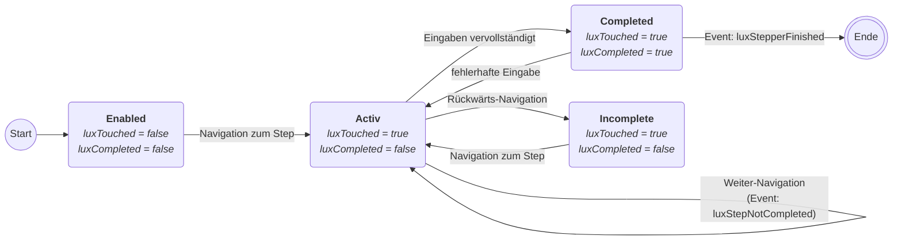

# LUX-Stepper-Large


- [LUX-Stepper-Large](#lux-stepper-large)
  - [Overview / API](#overview--api)
    - [Best Practices](#best-practices)
    - [Aufbau des Steppers](#aufbau-des-steppers)
      - [Desktop Ansicht](#desktop-ansicht)
      - [Mobile Ansicht](#mobile-ansicht)
    - [Standard-Verhalten bei aktivierter Validierung](#standard-verhalten-bei-aktivierter-validierung)
    - [Verhalten bei luxA11YMode](#verhalten-bei-luxa11ymode)
      - [Empfohlene Umsetzung bei LuxNotCompleted](#empfohlene-umsetzung-bei-luxnotcompleted)
    - [Fehlerbehandlung bei nachträglich besuchten Feldern und aktivierte Validierung](#fehlerbehandlung-bei-nachträglich-besuchten-feldern-und-aktivierte-validierung)
    - [Accessibility](#accessibility)
    - [Allgemein](#allgemein)
    - [@Input](#input)
    - [@Output](#output)
  - [Components](#components)
    - [LuxStepperLargeStepComponent](#luxstepperlargestepcomponent)
      - [Zustands-Diagramm eines einzelnen Steps mit aktivierter Validierung](#zustands-diagramm-eines-einzelnen-steps-mit-aktivierter-validierung)
      - [Allgemein](#allgemein-1)
      - [@Input](#input-1)
    - [@ViewChild](#viewchild)
  - [Classes / Interfaces](#classes--interfaces)
    - [LuxVetoState (enum)](#luxvetostate-enum)
    - [ILuxStepperLargeStep](#iluxstepperlargestep)
    - [LuxStepperLargeButtonInfo](#luxstepperlargebuttoninfo)
    - [LuxStepperLargeClickEvent](#luxstepperlargeclickevent)
    - [LuxStepperLargeSelectionEvent](#luxstepperlargeselectionevent)
  - [Beispiele](#beispiele)
    - [1. Stepper mit einem Step als ausgelagerte Komponente](#1-stepper-mit-einem-step-als-ausgelagerte-komponente)

## Overview / API

Der Lux-Stepper-Large implementiert das sogenannte Wizard-Pattern. Mit diesem Pattern können komplexe Prozesse vereinfacht werden, die nur selten oder von unerfahrenen Benutzerninnen ausgeführt werden. Dabei wird der Prozess in einzelne Schritte aufgeteilt, die dann in einer festen Reihefolgen nacheinander abgearbeitet werden.
Dadurch können sich die Nutzerinnen besser auf die jeweiligen Inhalte kontzentrieren und die Fehlerwahrscheinlichkeit nimmt ab.
Hängt ein Schritt von vorhergehenden Nutzereingaben ab, stellt der Stepper sicher, dass die jeweils relevanten Schritte und Informationen richtig angezeigt werden.

Der Stepper ist eher ungeeignet für erfahrene Nutzer (Poweruser) oder wenn es ein überschaubarer Prozess ist. Hier können ein einzelnes (sich aufbauendes) Formular oder die Tab-Komponente eine alternative Lösung sein.

### Best Practices

- Die Anzahl der Schritte sollte nicht größer als 10 sein.
- Schritt 1 soll einen Überblick über den folgenden Prozess enthalten, z.B. welche Daten und Dokumente im Folgenden benötigt werden, die zu erwartende Bearbeitungszeit oder ob Bearbeitungsgebühren für diesen Prozess anfallen.
- Der letzte Schritt soll eine Zusammenfassung aller eingegebenen Daten enthalten. Hier werden auch notwendige Zustimmungen für die weitere Verarbeitung, z.B. zum Speichern der Daten, abgefragt.
- Die Informationen und Angaben in einem Schritt sollen thematisch zusammen gehören.
- Die Navigationsliste enthält alle Schritte. Optionale oder abhängige Schritte sind zunächst deaktiviert (grau dargestellt) und werden bei Bedarf während des Prozesses aktiviert.
- Jeder Schritt erhält eine prägnante Überschrift, die als luxTitle ebenfalls in der Navigationsliste erscheint (evtl. verkürzt).
- Die Nutzereingaben sollen beim Verlassen eines Schritts zwischengespeichert werden, damit der Nutzer den Prozess unterbrechen und zu einem späteren Zeitpunkt fortsetzen kann.

**Tipp:** Enthält ein Prozess Abzweigungen und optionale Schritte, ist eine sorgfältige Planung **VOR** der Implementierung notwendig. Wir empfehlen den Prozess an Hand eines Flussdiagramms zu modellieren und mit allen Stakeholdern abzusprechen. Anschließend können daraus die notwendigen einzelnen Schritte für einenen Stepper ermittelt und die UI dafür konzepiert werden.

### Aufbau des Steppers

#### Desktop Ansicht


1. Navigationsliste - Liste aller Schritte des Steppers
2. Content-Bereich - der Inhaltsbereich des aktuellen Schritts
3. Stepper-Buttons - Navigation-Buttons zu dem direkten Vorgänger und Nachfolger des aktuellen Schritts

#### Mobile Ansicht


1. Step-Header - Nummer des aktuellen Schritts und Icon-Button zum Öffnen der Navigationsliste
2. Content-Bereich - der Inhaltsbereich des aktuellen Schritts
3. Stepper-Buttons - Navigation-Buttons zu dem direkten Vorgänger und Nachfolger des aktuellen Schritts
4. Navigationsliste - wird in einem separatem Overlay geöffnet

### Standard-Verhalten bei aktivierter Validierung

Das Standardverhalten des Steppers sieht es vor, dass der Nutzer einen Schritt nach dem anderen in der vorhergesehenen Reihenfolge durchläuft. Erst wenn ein Schritt vollständig und fehlerfrei abgearbeitet wurde, kann zu dem nächsten Schritt navigiert werden.
Der letzte Schritt des Steppers soll eine Zusammenfassung der zuvor eingegebenen Daten und ausgewählten Optionen enthalten. Das Abschließen des letzten Schritts ist gleichzeitig der Abschluss des gesamten Prozesses.

Über die Stepper-Buttons unterhalb des Content-Bereichs können der direkte Nachfolgeschritt bzw. der direkte Vorgänger erreicht werden.
Die Navigationsliste bietet den Nutzerinnen einen Überblick über den gesamten Prozess und den aktuellen Fortschritt. Gleichzeitig können bereits besuchte Schritte über die Navigationsliste direkt erreicht werden.

### Verhalten bei luxA11YMode

Für eine bessere Barrierefreiheit werden die "Weiter"-Buttons nicht mehr über das disabled-Attribut, sondern über aria-disabled gesteuert.
Dadurch bleiben diese Buttons für alle Nutzerinnen immer wahrnehmbar, klickbar und tastaturbedienbar.
Im luxA11YMode wird die "Weiter"-Navigation solange verhindert, bis der Schritt als vollständig gilt. Ist der Schritt nicht vollständigt, wird durch den Button-Klick ein Fehler-Event ausgelöst. Dieses muss in der Anwendung separat behandelt werden, s.u.
Nach dem erfolgreichen Abschliessen eines Schritts, kann über die Buttons und die Navigationsliste wie gewohnt navigiert werden.

#### Empfohlene Umsetzung bei LuxNotCompleted

- Nicht beantwortete Pflichtangaben werden in den Fehlerstatus versetzt.
- Eine permanente Fehlermeldung, z.B. in einer lux-textbox, am Ende des Step-Contents mit einer Liste der unvollständigen und fehlerhaften Felder erscheint, solange bis der Schritt erfolgreich abgeschlossen ist. Siehe Demoanwendung.
- Bei großen Formularen (insbesondere in der mobilen Ansicht) soll automatisch zum ersten fehlerhaften Eingabefeld gescrollt werden.

### Fehlerbehandlung bei nachträglich besuchten Feldern und aktivierte Validierung

Geht ein Nutzer zu einem bereits abgeschlossenen (fehlerfreien) Schritt zurück und versetzt diesen wieder in einen Fehlerzustand, z.B. durch Löschen einer Pflichtangabe, wird die Navigation zu nachfolgenden Schritten solange verhindert, bis der Fehler behoben wurde. Ein Klick auf den "Weiter"-Button löst das Event luxNotCompleted aus und soll mit einer entsprechenden Fehlermeldung behandelt werden (s.o.).
Der Nutzer kann jedoch zu vorherigen Schritten zurück navigieren. In der Navigations-Liste wird der fehlerhafte Schritt für den Nutzer durch ein Icon hinter dem Textlabel markiert. Auch aus einem vorhergehenden Schritt kann der Nutzer nicht über den fehlerhaften Schritt hinaus navigieren, bei dem Versuch erscheint eine Snackbar mit einer Fehlermeldung und der Nummer des fehlerhaften Schritts.

### Accessibility

Für die Verbesserung der Zugänglichkeit wurde der luxA11YMode eingeführt. Dieser erfüllt die technischen Bedingungen und gewährleistet die Funtkionalität von Assistenztechnologien. Er wird mit v19 der LUX-Components zum Standard bei aktivierter Validierung.

Ein weiteres Erfolgskriterium zur Barrierefreiheit ist die Vorhersehbarkeit. Für den Stepper bedeutet es, dass die einzelnen Schritte in einer logischen Reihenfolge erfolgen sollen. Jeder Schritt ist in sich abgeschlossen und behandelt ein bestimmtes Thema.
Die Zusammenfassung im letzten Schritt erfolgt in der selben Reihenfolge und mit den selben Überschriften der jeweiligen Schritte.
Die Nutzereingaben werden in der Zusammenfassung klar gegliedert in Textform dargestellt.

**Wichtig:** Textfelder im Zustand "readonly" oder "disabled" sind nicht barrierefrei, und dürfen für die Anzeige der Daten in einer Zusammenfassung nicht verwendet werden!

### Allgemein

| Name     | Beschreibung      |
| -------- | ----------------- |
| selector | lux-stepper-large |

### @Input

| Name                    | Typ                       | Beschreibung                                                                                                                                                                                                                                                                                                                        |
| ----------------------- | ------------------------- | ----------------------------------------------------------------------------------------------------------------------------------------------------------------------------------------------------------------------------------------------------------------------------------------------------------------------------------- |
| luxPrevButtonConfig     | LuxStepperLargeButtonInfo | Konfigurationsobjekt des Zurück-Buttons.                                                                                                                                                                                                                                                                                            |
| luxNextButtonConfig     | LuxStepperLargeButtonInfo | Konfigurationsobjekt des Weiter-Buttons.                                                                                                                                                                                                                                                                                            |
| luxFinButtonConfig      | LuxStepperLargeButtonInfo | Konfigurationsobjekt des Abschließen-Buttons.                                                                                                                                                                                                                                                                                       |
| luxCurrentStepNumber    | number                    | Der Index des aktuellen Schritts (0..n). (Two-Way-Binding möglich)                                                                                                                                                                                                                                                                  |
| luxStepValidationActive | boolean                   | Über diese Property kann die Validierung der Schritte (de-)aktiviert werden. Wenn die Validierung deaktiviert wird, dann ist er Weiter-Button immer aktiv und nur die Veto-Funktionen können das Navigieren zum nächsten Schritt verhindern.                                                                                        |
| luxA11YMode             | boolean                   | Diese Property verwendet bei aktivierter Validierung aria-disabled statt wie bisher disabled bei den NextButtons. Dieses erfordert eine Anpassung beim Eventhandling (siehe [Empfohlene Umsetzung bei LuxNotCompleted](#empfohlene-umsetzung-bei-luxnotcompleted)). Dieser Modus wird mit v19 zum Standard bei aktiver Validierung. |

### @Output

| Name                       | Typ                                           | Beschreibung                                                                                                                     |
| -------------------------- | --------------------------------------------- | -------------------------------------------------------------------------------------------------------------------------------- |
| luxStepperFinished         | EventEmitter \<void>                          | Das Event wird gefeuert, wenn der Stepper erfolgreich abgeschlossen wurde.                                                       |
| luxStepChanged             | EventEmitter \<LuxStepperLargeSelectionEvent> | Das Event wird gefeuert, wenn der Schritt gewechselt wird.                                                                       |
| luxCurrentStepNumberChange | EventEmitter \<number\>                       | Das Event wird gefeuert, wenn der Schritt gewechselt wird und ermöglicht das Two-Way-Binding.                                    |
| luxStepNotComplete         | EventEmitter \<number\>                       | Das Event wird gefeuert, wenn der luxA11YMode aktiviert ist und der User den NextButton betätigt bevor luxCompleted = true gilt. |

## Components

### LuxStepperLargeStepComponent

Diese Component entspricht einem einzelnen Step im Stepper.

#### Zustands-Diagramm eines einzelnen Steps mit aktivierter Validierung



#### Allgemein

| Name     | Beschreibung           |
| -------- | ---------------------- |
| selector | lux-stepper-large-step |

#### @Input

| Name         | Typ                                                                | Beschreibung                                                                                                                                                                                                                                                                        |
| ------------ | ------------------------------------------------------------------ | ----------------------------------------------------------------------------------------------------------------------------------------------------------------------------------------------------------------------------------------------------------------------------------- |
| luxTitle     | string                                                             | Der Titel des Schritts, wird z.B. in der Navigationsleiste angezeigt.                                                                                                                                                                                                               |
| luxTouched   | boolean                                                            | Gibt an, ob der Schritt bereits besucht wurde.                                                                                                                                                                                                                                      |
| luxCompleted | boolean                                                            | Gibt an, ob der Schritt erfolgreich abgeschlossen wurde.                                                                                                                                                                                                                            |
| luxVetoFn    | (clickEvent: LuxStepperLargeClickEvent) => Promise\<LuxVetoState\> | Diese Funktion wird aufgerufen, wenn versucht wird, den Schritt zu wechseln. D.h. hier kann zusätzliche Logik (Validierung im Backend,...) ausgeführt werden. Als Rückgabewert liefert das Promise `LuxVetoState.navigationAccepted` oder `LuxVetoState.navigationRejected` zurück. |

### @ViewChild

| Name            | ng-Template-Id | Typ                | Beschreibung               |
| --------------- | -------------- | ------------------ | -------------------------- |
| contentTemplate | #content       | TemplateRef\<any\> | Enthält den Schrittinhalt. |

## Classes / Interfaces

### LuxVetoState (enum)

| Name               | Wert | Typ       | Beschreibung                                                                                                 |
| ------------------ | ---- | --------- | ------------------------------------------------------------------------------------------------------------ |
| navigationAccepted | 0    | enum-Wert | Dieser Wert wird verwendet, wenn zum nächsten Schritt navigiert werden darf. (siehe `luxVetoFn`)             |
| navigationRejected | 1    | enum-Wert | Dieser Wert wird verwendet, wenn _**nicht**_ zum nächsten Schritt navigiert werden darf. (siehe `luxVetoFn`) |

### ILuxStepperLargeStep

| Name            | Typ                                                                     | Beschreibung                                                                                                                                                                                                                                                                        |
| --------------- | ----------------------------------------------------------------------- | ----------------------------------------------------------------------------------------------------------------------------------------------------------------------------------------------------------------------------------------------------------------------------------- |
| luxTitle        | string                                                                  | Der Titel des Schritts, wird z.B. in der Navigationsleiste angezeigt.                                                                                                                                                                                                               |
| luxTouched      | boolean                                                                 | Gibt an, ob der Schritt bereits besucht wurde.                                                                                                                                                                                                                                      |
| luxCompleted    | boolean                                                                 | Gibt an, ob der Schritt erfolgreich abgeschlossen wurde.                                                                                                                                                                                                                            |
| luxDisabled     | boolean                                                                 | Gibt an, ob der Schritt erfolgreich abgeschlossen wurde.                                                                                                                                                                                                                            |
| luxVetoFn       | (clickEvent:&nbsp;LuxStepperLargeClickEvent) => Promise\<LuxVetoState\> | Diese Funktion wird aufgerufen, wenn versucht wird, den Schritt zu wechseln. D.h. hier kann zusätzliche Logik (Validierung im Backend,...) ausgeführt werden. Als Rückgabewert liefert das Promise `LuxVetoState.navigationAccepted` oder `LuxVetoState.navigationRejected` zurück. |
| contentTemplate | TemplateRef\<any\>                                                      | Enthält eine `TemplateRef` auf den Inhalt.                                                                                                                                                                                                                                          |

### LuxStepperLargeButtonInfo

| Name               | Typ                             | Beschreibung                                                    |
| ------------------ | ------------------------------- | --------------------------------------------------------------- |
| label              | string                          | Die Bezeichnung des Buttons.                                    |
| color              | Siehe [lux-button](lux‐button). | Siehe [lux-button](lux‐button).                                 |
| iconName           | string                          | Der Iconname.                                                   |
| iconShowRight      | boolean                         | Gibt an, ob das Icon rechts von der Bezeichnung angezeigt wird. |
| alignIconWithLabel | boolean                         | Gibt an, ob das Icon anhand der Bezeichnung ausgerichtet wird.  |

Es gibt die folgenden Konstanten für die Standardkonfigurationen:

- LUX_STEPPER_LARGE_DEFAULT_PREV_BTN_CONF
- LUX_STEPPER_LARGE_DEFAULT_NEXT_BTN_CONF
- LUX_STEPPER_LARGE_DEFAULT_FIN_BTN_CONF

### LuxStepperLargeClickEvent

| Name     | Typ                                 | Beschreibung                                                                                |
| -------- | ----------------------------------- | ------------------------------------------------------------------------------------------- |
| stepper  | LuxStepperLargeComponent            | Die Stepperkomponente.                                                                      |
| newIndex | number                              | Der neue Index zu dem navigiert wird, wenn kein Veto eingelegt wird. (Siehe `luxVetoFn`).   |
| newStep  | ILuxStepperLargeStep                | Der neue Schritt zu dem navigiert wird, wenn kein Veto eingelegt wird. (Siehe `luxVetoFn`). |
| newStep  | LuxStepperLargeClickEventSourceType | Gibt die Quelle des Events an.                                                              |

### LuxStepperLargeSelectionEvent

| Name         | Typ                      | Beschreibung                       |
| ------------ | ------------------------ | ---------------------------------- |
| stepper      | LuxStepperLargeComponent | Die Stepperkomponente.             |
| currentIndex | number                   | Der Index des aktuellen Schritts.  |
| currentStep  | ILuxStepperLargeStep     | Der aktuelle Schritt.              |
| prevIndex    | number                   | Der Index des vorherigen Schritts. |
| prevStep     | ILuxStepperLargeStep     | Der vorherige Schritt.             |

## Beispiele

### 1. Stepper mit einem Step als ausgelagerte Komponente


Ts: ExampleComponent

```typescript
export class ExampleComponent implements OnInit, OnDestroy {
    infoCompleted = false;

  personForm: FormGroup;
  personCompleted = false;

  consentForm: FormGroup;
  consentCompleted = false;

  subscriptions: Subscription[] = [];

  constructor(
    private snackbar: LuxSnackbarService,
    public dataService: ExampleDataService,
    private router: Router
  ) {
    this.personForm = new FormGroup({
      givenName: new FormControl<string>('', Validators.required),
      familyName: new FormControl<string>('', Validators.required)
    });

    this.subscriptions.push(
      this.personForm.statusChanges.subscribe(() => {
        this.personCompleted = this.personForm.valid;

        if (this.personCompleted) {
          this.dataService.data.person = this.personForm.value;
        }
      })
    );

    this.consentForm = new FormGroup({
      consent: new FormControl<string>('', Validators.required)
    });
  }

  onFinish() {
    // In dieser Demo gibt es kein Backend und deshalb wird eine
    // Snackbar angezeigt und die Seite neu geladen, damit sich der
    // Stepper zurücksetzt.
    const snackbarDuration = 5000;

    this.snackbar.open(snackbarDuration, {
      iconName: 'fas fa-info',
      iconSize: '2x',
      iconColor: 'green',
      text: 'Stepper erfolgreich abgeschlossen!'
    });

    setTimeout(() => {
      let currentUrl = this.router.url;
      this.router.routeReuseStrategy.shouldReuseRoute = () => false;
      this.router.onSameUrlNavigation = 'reload';
      this.router.navigate([currentUrl]);
    }, snackbarDuration);
  }

  ngOnInit() {
    this.subscriptions.push(
      this.consentForm.statusChanges.subscribe(() => {
        this.consentCompleted = this.consentForm.valid;

        if (this.consentCompleted) {
          this.dataService.consent = this.consentForm.value;
        }
      })
    );

    // Damit der Schritt nicht direkt seinen Fertig-Haken anzeigt,
    // wurde hier eine kleine Verzögerung eingebaut.
    setTimeout(() => {
      this.infoCompleted = true;
    }, 3000);
  }

  ngOnDestroy() {
    this.subscriptions.forEach((subscription) => subscription.unsubscribe());
  }
}
```

Html: ExampleComponent

```html
<div class="app-stepper-large-container">
  <lux-stepper-large (luxStepperFinished)="onFinish()">
    <lux-stepper-large-step luxTitle="Allgemeine Information" [luxCompleted]="infoCompleted">
      <h2 class="example-lux-stepper-large-h2">Allgemeine Information</h2>
      <p>
        Lorem ipsum dolor sit amet, consetetur sadipscing elitr, sed diam nonumy eirmod tempor invidunt ut labore et dolore magna aliquyam
        erat, sed diam voluptua. At vero eos et accusam et justo duo dolores et ea rebum. Stet clita kasd gubergren, no sea takimata sanctus
        est Lorem ipsum dolor sit amet. Lorem ipsum dolor sit amet, consetetur sadipscing elitr, sed diam nonumy eirmod tempor invidunt ut
        labore et dolore magna aliquyam erat, sed diam voluptua. At vero eos et accusam et justo duo dolores et ea rebum. Stet clita kasd
        gubergren, no sea takimata sanctus est Lorem ipsum dolor sit amet.
      </p>
      <p>
        Duis autem vel eum iriure dolor in hendrerit in vulputate velit esse molestie consequat, vel illum dolore eu feugiat nulla facilisis
        at vero eros et accumsan et iusto odio dignissim qui blandit praesent luptatum zzril delenit augue duis dolore te feugait nulla
        facilisi. Lorem ipsum dolor sit amet, consectetuer adipiscing elit, sed diam nonummy nibh euismod tincidunt ut laoreet dolore magna
        aliquam erat volutpat.
      </p>
      <p>Nach 3 Sekunden wird der Weiter-Button aktiviert.</p>
    </lux-stepper-large-step>

    <lux-stepper-large-step luxTitle="Angaben zur Person" [formGroup]="personForm" [luxCompleted]="personCompleted">
      <h2 class="example-lux-stepper-large-h2">Angaben zur Person</h2>
      <p>
        Lorem ipsum dolor sit amet, consetetur sadipscing elitr, sed diam nonumy eirmod tempor invidunt ut labore et dolore magna aliquyam
        erat, sed diam voluptua. At vero eos et accusam et justo duo dolores et ea rebum. Stet clita kasd gubergren, no sea takimata sanctus
        est Lorem ipsum dolor sit amet. Lorem ipsum dolor sit amet, consetetur sadipscing elitr, sed diam nonumy eirmod tempor invidunt ut
        labore et dolore magna aliquyam erat, sed diam voluptua. At vero eos et accusam et justo duo dolores et ea rebum. Stet clita kasd
        gubergren, no sea takimata sanctus est Lorem ipsum dolor sit amet.
      </p>
      <p>
        Duis autem vel eum iriure dolor in hendrerit in vulputate velit esse molestie consequat, vel illum dolore eu feugiat nulla facilisis
        at vero eros et accumsan et iusto odio dignissim qui blandit praesent luptatum zzril delenit augue duis dolore te feugait nulla
        facilisi. Lorem ipsum dolor sit amet, consectetuer adipiscing elit, sed diam nonummy nibh euismod tincidunt ut laoreet dolore magna
        aliquam erat volutpat.
      </p>
      <lux-layout-form-row>
        <lux-input luxLabel="Vorname" luxName="given-name" luxControlBinding="givenName" *luxLayoutRowItem="{}"></lux-input>
        <lux-input luxLabel="Nachname" luxName="family-name" luxControlBinding="familyName" *luxLayoutRowItem="{}"></lux-input>
      </lux-layout-form-row>
    </lux-stepper-large-step>

    <app-example-step></app-example-step>

    <lux-stepper-large-step luxTitle="Einwilligung" [formGroup]="consentForm" [luxCompleted]="consentCompleted">
      <h2>Einwilligung</h2>
      <p>
        Lorem ipsum dolor sit amet, consetetur sadipscing elitr, sed diam nonumy eirmod tempor invidunt ut labore et dolore magna aliquyam
        erat, sed diam voluptua. At vero eos et accusam et justo duo dolores et ea rebum. Stet clita kasd gubergren, no sea takimata sanctus
        est Lorem ipsum dolor sit amet. Lorem ipsum dolor sit amet, consetetur sadipscing elitr, sed diam nonumy eirmod tempor invidunt ut
        labore et dolore magna aliquyam erat, sed diam voluptua. At vero eos et accusam et justo duo dolores et ea rebum. Stet clita kasd
        gubergren, no sea takimata sanctus est Lorem ipsum dolor sit amet.
      </p>
      <p>
        Duis autem vel eum iriure dolor in hendrerit in vulputate velit esse molestie consequat, vel illum dolore eu feugiat nulla facilisis
        at vero eros et accumsan et iusto odio dignissim qui blandit praesent luptatum zzril delenit augue duis dolore te feugait nulla
        facilisi. Lorem ipsum dolor sit amet, consectetuer adipiscing elit, sed diam nonummy nibh euismod tincidunt ut laoreet dolore magna
        aliquam erat volutpat.
      </p>
      <lux-toggle luxLabel="Hier mit stimme ich den Bedingungen zu" luxControlBinding="consent"></lux-toggle>
    </lux-stepper-large-step>
    <lux-stepper-large-step luxTitle="Zusammenfassung" [luxCompleted]="true">
      <h2>Zusammenfassung</h2>
      <p>
        Lorem ipsum dolor sit amet, consetetur sadipscing elitr, sed diam nonumy eirmod tempor invidunt ut labore et dolore magna aliquyam
        erat, sed diam voluptua. At vero eos et accusam et justo duo dolores et ea rebum. Stet clita kasd gubergren, no sea takimata sanctus
        est Lorem ipsum dolor sit amet. Lorem ipsum dolor sit amet, consetetur sadipscing elitr, sed diam nonumy eirmod tempor invidunt ut
        labore et dolore magna aliquyam erat, sed diam voluptua. At vero eos et accusam et justo duo dolores et ea rebum. Stet clita kasd
        gubergren, no sea takimata sanctus est Lorem ipsum dolor sit amet.
      </p>
      <p>In dieser Demo werden die Daten einfach ausgegeben:</p>
      <pre>{{ dataService.data | json }}</pre>
    </lux-stepper-large-step>
  </lux-stepper-large>
</div>
```

Scss: ExampleComponent

```scss
.app-stepper-large-container {
  margin: 10px;
  overflow: hidden;
  height: calc(100% - 20px);
  box-shadow: 0px 2px 1px -1px rgba(0, 0, 0, 0.2), 0px 1px 1px 0px rgba(0, 0, 0, 0.14), 0px 1px 3px 0px rgba(0, 0, 0, 0.60);
}

lux-stepper-large {
  background-color: var(--lux-theme-app-data-bg);
}
```

TS: ExampleDataService

```typescript
import { Injectable } from '@angular/core';

@Injectable({
  providedIn: 'root'
})
export class ExampleDataService {
  data = { person: { givenName: '', familyName: '' }, address: { street: '', number: '', city: '' } };
  consent = false;

  constructor() {}
}
```

TS: ExampleStepComponent

```typescript
@Component({
  selector: 'app-example-step',
  templateUrl: './example-step.component.html',
  providers: [{ provide: LuxStepperLargeStepComponent, useExisting: ExampleStepComponent }]
})
export class ExampleStepComponent extends LuxStepperLargeStepComponent implements OnInit, OnDestroy {
  initVetoMessage = true;
  showVetoMessage = false;
  messages: ILuxMessage[] = [
    {
      text: 'Beim ersten Klick auf den Weiter-Button wird in dieser Demo ein Veto simuliert.',
      iconName: 'fas fa-exclamation-circle',
      color: 'red'
    }
  ];

  form: FormGroup;

  subscriptions: Subscription[] = [];

  constructor(public dataService: ExampleDataService) {
    super();

    this.form = new FormGroup({
      street: new FormControl<string>('', Validators.required),
      number: new FormControl<string>('', Validators.required),
      city: new FormControl<string>('', Validators.required)
    });

    this.luxCompleted = this.form.valid;

    this.subscriptions.push(
      this.form.statusChanges.subscribe(() => {
        this.luxCompleted = this.form.valid;
      })
    );
  }

  ngOnInit(): void {
    this.luxTitle = 'Angaben zur Adresse';
    this.luxVetoFn = this.createVetoPromise;
  }

  createVetoPromise(event: LuxStepperLargeClickEvent): Promise<LuxVetoState> {
    const component = this;

    return new Promise(function (resolve, reject) {
      // Hier kann man prüfen, ob der Step valide ist. Auch das Backend
      // kann aufgerufen werden. Für die Demo gibt es aber kein Backend,
      // deshalb wird hier die setTimeout-Methode verwendet.
      // Hier kann man:
      // - Die Daten des Steps validieren.
      // - Die Daten aus dem Step in seine Datenstruktur übertragen.
      // - Über die resolve-Methode zurückmelden, ob zum nächsten Schritt navigiert werden darf.
      setTimeout(() => {
        // Prüfen, ob das Formular valide ist.
        if (component.form.valid) {
          // Hier werden die Daten aus dem Formular in den Datenservice übertragen.
          component.dataService.data.address = component.form.value;

          // Als letztes wird der Step als valide gekennzeichnet.
          component.luxCompleted = true;
        } else {
          // Das Formular ist noch nicht valide und deswegen wird der Step
          // als noch nicht fertig gekennzeichnet.
          component.luxCompleted = false;
        }

        if (component.initVetoMessage) {
          component.showVetoMessage = true;
          component.initVetoMessage = false;

          resolve(LuxVetoState.navigationRejected);
        } else {
          resolve(component.luxCompleted ? LuxVetoState.navigationAccepted : LuxVetoState.navigationRejected);
        }
      }, 250);
    });
  }

  hideVetoMessage() {
    this.showVetoMessage = false;
  }

  ngOnDestroy() {
    this.subscriptions.forEach((subscription) => subscription.unsubscribe());
  }
}
```

Html: ExampleStepComponent

```html
<ng-template #content>
  <ng-container [formGroup]="form">
    <h2>Angaben zur Adresse</h2>
    <p>
      Lorem ipsum dolor sit amet, consetetur sadipscing elitr, sed diam nonumy eirmod tempor invidunt ut labore et dolore magna aliquyam
      erat, sed diam voluptua. At vero eos et accusam et justo duo dolores et ea rebum. Stet clita kasd gubergren, no sea takimata sanctus
      est Lorem ipsum dolor sit amet. Lorem ipsum dolor sit amet, consetetur sadipscing elitr, sed diam nonumy eirmod tempor invidunt ut
      labore et dolore magna aliquyam erat, sed diam voluptua. At vero eos et accusam et justo duo dolores et ea rebum. Stet clita kasd
      gubergren, no sea takimata sanctus est Lorem ipsum dolor sit amet.
    </p>
    <lux-layout-form-row>
      <lux-input luxLabel="Straße" luxName="street" luxControlBinding="street" *luxLayoutRowItem="{}"></lux-input>
      <lux-input luxLabel="Nummer" luxName="streetnumber" luxControlBinding="number" *luxLayoutRowItem="{}"></lux-input>
      <div *luxLayoutRowItem="{ empty: true }"></div>
    </lux-layout-form-row>
    <lux-layout-form-row>
      <lux-input luxLabel="Stadt" luxName="city" luxControlBinding="city" *luxLayoutRowItem="{}"></lux-input>
      <div *luxLayoutRowItem="{ empty: true }"></div>
      <div *luxLayoutRowItem="{ empty: true }"></div>
    </lux-layout-form-row>

    <lux-message-box [luxMessages]="messages" *ngIf="showVetoMessage" (luxMessageBoxClosed)="hideVetoMessage()"></lux-message-box>
  </ng-container>
</ng-template>

```
