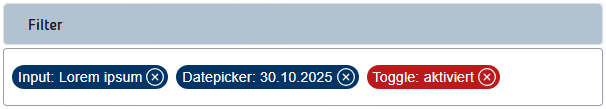

# LUX-Filter-Form

Filter (aufgeklappt):


Filter (zugeklappt):



- [LUX-Filter-Form](#lux-filter-form)
  - [Overview / API](#overview--api)
    - [Allgemein](#allgemein)
    - [@Input](#input)
    - [@Output](#output)
  - [Components](#components)
    - [LuxFilterSaveDialogComponent](#luxfiltersavedialogcomponent)
      - [Allgemein](#allgemein-1)
    - [LuxFilterLoadDialogComponent](#luxfilterloaddialogcomponent)
      - [Allgemein](#allgemein-2)
    - [LuxFilterItemDirective](#luxfilteritemdirective)
      - [Allgemein](#allgemein-3)
  - [Classes / Services](#classes--services)
    - [LuxFilter](#luxfilter)
    - [LuxFilterItem](#luxfilteritem)
  - [Beispiele](#beispiele)
    - [1. Standard](#1-standard)
    - [2. Mit Custom-Component - Filter in Subkomponente](#2-mit-custom-component---filter-in-subkomponente)

## Overview / API

### Allgemein

| Name     | Beschreibung    |
| -------- | --------------- |
| selector | lux-filter-form |

### @Input

| Name                    | Typ             | Beschreibung                                                                       |
| ----------------------- | --------------- | ---------------------------------------------------------------------------------- |
| luxTitle                | string          | Titel des Filters                                                                  |
| luxButtonRaised         | boolean         | Gibt an, ob die Filter-Buttons hervorgehoben dargestellt werden.                   |
| luxButtonFilterLabel    | string          | Bezeichnung des Filter-Buttons.                                                    |
| luxButtonResetLabel     | string          | Bezeichnung des Reset-Buttons.                                                     |
| luxButtonSaveLabel      | string          | Bezeichnung des Speichern-Buttons.                                                 |
| luxButtonLoadLabel      | string          | Bezeichnung des Laden-Buttons.                                                     |
| luxDefaultFilterMessage | string          | Die Standardfilternachricht wird angezeigt, wenn der Filter unverändert ist.       |
| luxShowChips            | boolean         | Gibt an, ob die Filterwerte im eingeklappten Zustand als Chips dargestellt werden. |
| luxStoredFilters        | LuxFilter[]     | Ein Array mit den vorhandenen Filtern                                              |
| luxFilterExpanded       | boolean         | Gibt an, ob der Filter auf-/zugeklappt dargestellt wird.                           |
| luxFilterValues         | Object          | Die aktuellen Filterwerte als JSON-Objekt.                                         |
| luxButtonFilterColor    | LuxThemePalette | Farbe ('primary', 'accent', 'warn', 'default')                                     |
| luxButtonDialogSave     | LuxThemePalette | Farbe ('primary', 'accent', 'warn', 'default')                                     |
| luxButtonDialogCancel   | LuxThemePalette | Farbe ('primary', 'accent', 'warn', 'default')                                     |
| luxButtonDialogLoad     | LuxThemePalette | Farbe ('primary', 'accent', 'warn', 'default')                                     |
| luxButtonDialogDelete   | LuxThemePalette | Farbe ('primary', 'accent', 'warn', 'default')                                     |
| luxButtonDialogClose    | LuxThemePalette | Farbe ('primary', 'accent', 'warn', 'default')                                     |
| luxDisableShortcut      | boolean         | Property, die das Tastaturkürzel für das Auslösen des Filters unterdrückt.         |
| luxHideChipsBorder      | boolean         | Gibt an, ob ein Rahmen um die Chips dargestelt wird.                               |
| luxHideMenu             | boolean         | Gibt an, ob das Filtermenü im oberen Bereich angezeigt werden soll.                |

### @Output

| Name                    | Typ                       | Beschreibung                                                                                                           |
| ----------------------- | ------------------------- | ---------------------------------------------------------------------------------------------------------------------- |
| luxOnFilter             | EventEmitter \<string>    | Output-Event welches ausgelöst wird, wenn der Filter-Button gedrückt wird. Als Daten werden die Filterwerte übergeben. |
| luxOnSave               | EventEmitter \<LuxFilter> | Output-Event welches ausgelöst wird, wenn ein neuer Filter gespeichert wird.                                           |
| luxOnLoad               | EventEmitter \<string>    | Output-Event welches ausgelöst wird, wenn ein Filter geladen werden soll.                                              |
| luxOnDelete             | EventEmitter \<LuxFilter> | Output-Event welches ausgelöst wird, wenn ein Filter gelöscht werden soll.                                             |
| luxOnReset              | EventEmitter \<void>      | Output-Event welches ausgelöst wird, wenn der aktuelle Filter zurückgesetzt werden soll.                               |
| luxFilterExpandedChange | EventEmitter \<boolean>   | Output-Event welches ausgelöst wird, wenn der Filter ein-/ausgeklappt wird.                                            |

## Components

### LuxFilterSaveDialogComponent

Ein LuxFilterSaveDialogComponent bietet ein Eingabefeld für den Filternamen, einen Speichern-Button und einen Abbrechen-Button.

#### Allgemein

| Name     | Beschreibung           |
| -------- | ---------------------- |
| selector | lux-filter-save-dialog |

### LuxFilterLoadDialogComponent

Ein LuxFilterLoadDialogComponent zeigt die vorhandenen Filter an und bietet eine Möglichkeit, einen Filter auszuwählen.

#### Allgemein

| Name     | Beschreibung           |
| -------- | ---------------------- |
| selector | lux-filter-load-dialog |

### LuxFilterItemDirective

Über die LuxFilterItemDirective werden die Filteritems bestimmt.

#### Allgemein

| Name     | Beschreibung  |
| -------- | ------------- |
| selector | luxFilterItem |

## Classes / Services

### LuxFilter

| Name | Typ    | Beschreibung                    |
| ---- | ------ | ------------------------------- |
| id   | string | Eine Id.                        |
| name | string | Ein eindeutiger Filtername.     |
| data | string | Die Filterwerte im JSON-Format. |

### LuxFilterItem

| Name          | Typ                                             | Beschreibung                                                             |
| ------------- | ----------------------------------------------- | ------------------------------------------------------------------------ |
| label         | string                                          | Eine Bezeichnung (z.B. Land).                                            |
| binding       | string                                          | Ein Binding (z.B. country).                                              |
| component     | LuxFormComponentBase                            | Die Formularkomponete (z.B. lux-input).                                  |
| value         | \<T = any>                                      | Der Wert.                                                                |
| defaultValues | any[]                                           | Die Defaultwerte.                                                        |
| color         | LuxThemePalette                                 | Eine Farbe.                                                              |
| disabled      | boolean                                         | Gibt an, ob das Filteritem deaktiviert ist.                              |
| hidden        | boolean                                         | Gibt an, ob das Filteritem ausgeblendet ist.                             |
| renderFn      | (filter: LuxFilterItem\<T>, value: T) => string | Die Render-Funktion liefert die Bezeichnung für den Filterwert als Chip. |

## Beispiele

### 1. Standard


Ts

```typescript
  @ViewChild(LuxFilterFormComponent) filterComponent!: LuxFilterFormComponent;

  autoCompleteOptions: any[] = [
    { label: 'Auto A', value: 'a' },
    { label: 'Auto B', value: 'b' },
    { label: 'Auto C', value: 'c' }
  ];

  singleSelectOptions: any[] = [
    { label: 'Single 4711', value: '4711' },
    { label: 'Single 4712', value: '4712' },
    { label: 'Single 4713', value: '4713' }
  ];

  multiSelectOptions: any[] = [
    { label: 'Multi 1', value: 1 },
    { label: 'Multi 2', value: 2 },
    { label: 'Multi 3', value: 3 }
  ];

  initFilter: any = { input: 'aaa' };
  currentFilter: any = this.initFilter;

  expanded = false;
  showFilterChips = true;

  storedFilters: LuxFilter[] = [];

  mediaQuerySubscription: Subscription;

  inputDisabled = false;
  inputHidden = false;
  autoCompleteDisabled = false;
  autoCompleteHidden = false;
  datepickerDisabled = false;
  datepickerHidden = false;
  singleSelectDisabled = false;
  singleSelectHidden = false;
  multiSelectDisabled = false;
  multiSelectHidden = false;
  toggleSelectDisabled = false;
  toggleSelectHidden = false;

  constructor(private mediaQuery: LuxMediaQueryObserverService) {
    this.mediaQuerySubscription = this.mediaQuery.getMediaQueryChangedAsObservable().subscribe(() => {
      if (this.mediaQuery.isSmallerOrEqual('xs')) {
        this.showFilterChips = false;
      } else {
        this.showFilterChips = true;
      }
    });
  }

  ngOnDestroy(): void {
    this.mediaQuerySubscription.unsubscribe();
  }

  compareValueFn = (o1: any, o2: any) => {
    return o1.value === o2.value;
  };

  renderToggleFn(filterItem: LuxFilterItem, value: any) {
    return value ? 'aktiviert' : 'deaktiviert';
  }

  onFilter(filter: any) {
    this.currentFilter = filter;
    console.log('Please filter...', filter);
  }

  onSave(filter: LuxFilter) {
    this.saveFilter(filter);
  }

  onDelete(filter: LuxFilter) {
    console.log('Filter deleted.', filter);
  }

  onReset() {
    console.log('Filter reset.');
  }

  onLoad(filterName: string) {
    this.initFilter = this.loadFilter(filterName);
  }

  private saveFilter(filter: LuxFilter) {
    // Hier müssten die Filtereinstellungen (z.B. in die Datenbank) geschrieben werden.
    this.storedFilters.push(filter);
    console.log('Filter saved.', filter);
  }

  private loadFilter(filterName: string) {
    // Hier müssten die Filtereinstellungen (z.B. aus der Datenbank) gelesen und zurückgeliefert werden.
    const luxFilter = this.storedFilters.find((filter) => filter.name === filterName);

    if (!luxFilter) {
      throw Error(`Es konnte kein Filter mit dem Namen "${filterName}" gefunden werden.`);
    }

    return JSON.parse(JSON.stringify(luxFilter.data));
  }
```

Html

```html
<lux-filter-form
  (luxOnFilter)="onFilter($event)"
  [(luxFilterExpanded)]="expanded"
  [luxFilterValues]="initFilter"
  (luxOnSave)="onSave($event)"
  (luxOnLoad)="onLoad($event)"
  (luxOnReset)="onReset()"
  (luxOnDelete)="onDelete($event)"
  [luxShowChips]="showFilterChips"
  [luxStoredFilters]="storedFilters"
  class="lux-ml-1 lux-mr-1 lux-mb-3"
>
  <div
    class="lux-grid lux-grid-cols-3 lt-md:lux-grid-cols-1 lux-gap-4 lux-mt-4"
  >
    <lux-input-ac
      luxLabel="Input"
      luxName="filter_input"
      luxAutocomplete="off"
      luxControlBinding="input"
      [luxFilterDisabled]="inputDisabled"
      [luxFilterHidden]="inputHidden"
      luxFilterItem
    ></lux-input-ac>
    <lux-autocomplete-ac
      luxLabel="Autocomplete"
      luxName="filter_autocomplete"
      [luxOptions]="autoCompleteOptions"
      luxControlBinding="autocomplete"
      [luxFilterDisabled]="autoCompleteDisabled"
      [luxFilterHidden]="autoCompleteHidden"
      luxFilterItem
    ></lux-autocomplete-ac>
    <lux-datepicker-ac
      luxLabel="Datepicker"
      luxName="filter_datepicker"
      luxControlBinding="datepicker"
      [luxFilterDisabled]="datepickerDisabled"
      [luxFilterHidden]="datepickerHidden"
      luxFilterItem
    ></lux-datepicker-ac>
    <lux-select-ac
      luxLabel="Single-Select"
      luxControlBinding="singleSelect"
      luxOptionLabelProp="label"
      [luxMultiple]="false"
      [luxOptions]="singleSelectOptions"
      [luxCompareWith]="compareValueFn"
      [luxFilterDisabled]="singleSelectDisabled"
      [luxFilterHidden]="singleSelectHidden"
      luxFilterColor="accent"
      luxFilterItem
    ></lux-select-ac>
    <lux-select-ac
      luxLabel="Multi-Select"
      luxControlBinding="multiSelect"
      luxOptionLabelProp="label"
      [luxMultiple]="true"
      [luxOptions]="multiSelectOptions"
      [luxCompareWith]="compareValueFn"
      [luxFilterDisabled]="multiSelectDisabled"
      [luxFilterHidden]="multiSelectHidden"
      luxFilterColor="accent"
      luxFilterItem
    ></lux-select-ac>
    <lux-toggle-ac
      luxLabel="Toggle"
      luxName="filter_toggle"
      luxControlBinding="toggle"
      [luxFilterRenderFn]="renderToggleFn"
      [luxFilterDisabled]="toggleSelectDisabled"
      [luxFilterHidden]="toggleSelectHidden"
      luxFilterColor="warn"
      luxFilterItem
    ></lux-toggle-ac>
  </div>
</lux-filter-form>
```

Json

```json
{
  "input": "Lorem ipsum",
  "autocomplete": {
    "label": "Auto A",
    "value": "a"
  },
  "datepicker": "2020-09-09T00:00:00.000Z",
  "singleSelect": {
    "label": "Single 4711",
    "value": "4711"
  },
  "multiSelect": [
    {
      "label": "Multi 1",
      "value": 1
    },
    {
      "label": "Multi 2",
      "value": 2
    }
  ],
  "toggle": true
}
```

### 2. Mit Custom-Component - Filter in Subkomponente

Ts - Custom Component

```typescript
@Component({
  selector: 'app-custom-filter-item',
  imports: [LuxInputAcComponent, LuxFilterItemDirective, LuxToggleAcComponent],
  templateUrl: './custom-filter-item.component.html',
  host: { class: 'lux-grid lux-grid-cols-12 lt-md:lux-grid-cols-1 lux-gap-4 lux-mt-4 lux-items-center' }
})
export class CustomFilterItemComponent implements AfterViewInit {
  filterDisabled = input<boolean>(true);
  filterHidden = input<boolean>(false);

  filterFormComponent = inject(LuxFilterFormComponent);

  formElements = viewChildren(LuxFilterItemDirective);

  ngAfterViewInit(): void {
    this.filterFormComponent.registerFilterItems([...this.formElements()]);
  }
}
```

Html - Custom Component

```html
<lux-input-ac
  class="lux-col-span-6 lt-md:lux-col-span-1"
  luxLabel="Custom-Component"
  luxName="customComponentInput"
  luxAutocomplete="off"
  luxControlBinding="customComponentInput"
  [luxFilterDisabled]="filterDisabled()"
  [luxFilterHidden]="filterHidden()"
  luxFilterItem
></lux-input-ac>
<lux-toggle-ac
  class="lux-col-span-6 lt-md:lux-col-span-1"
  luxLabel="Custom-Component"
  luxName="customComponentToggle"
  luxAutocomplete="off"
  luxControlBinding="customComponentToggle"
  [luxFilterDisabled]="filterDisabled()"
  [luxFilterHidden]="filterHidden()"
  [luxNoLabels]="true"
  luxFilterItem
></lux-toggle-ac>
```

Html - Filter

```html
  <lux-filter-form ...>
    ...
    <div class="lux-grid lux-grid-cols-12 lt-md:lux-grid-cols-1 lux-gap-4 lux-mt-4">
      <lux-input-ac
      class="lux-col-span-6 lt-md:lux-col-span-1"
      luxLabel="Input"
      luxName="filter_input"
      luxAutocomplete="off"
      luxControlBinding="input"
      [luxFilterDisabled]="inputDisabled"
      [luxFilterHidden]="inputHidden"
      luxFilterItem
    ></lux-input-ac>
      <app-custom-filter-item
        class="lux-col-span-12 lt-md:lux-col-span-1"
        [filterDisabled]="customDisabled"
        [filterHidden]="customHidden">
      </app-custom-filter-item>
    </div>
    ...
  </lux-filter-form>
```
