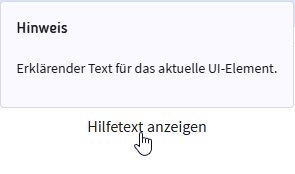
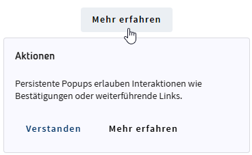

# Lux-Popup

- [Lux-Popup](#lux-popup)
  - [Overview / API](#overview--api)
    - [Allgemein](#allgemein)
    - [Interaktionsmodi](#interaktionsmodi)
  - [Components](#components)
    - [LuxPopupComponent](#luxpopupcomponent)
  - [Directives](#directives)
    - [LuxPopupTriggerDirective](#luxpopuptriggerdirective)
  - [Classes / Interfaces](#classes--interfaces)
    - [LuxPopupCloseReason](#luxpopupclosereason)
  - [Beispiele](#beispiele)
    - [1. Transientes Kontext-Popup](#1-transientes-kontext-popup)
    - [2. Persistentes Aktions-Popup](#2-persistentes-aktions-popup)
  - [Accessibility](#accessibility)
  - [Best Practices](#best-practices)
  - [Zusatzinformationen](#zusatzinformationen)

Die Popup-Komponente kombiniert die bekannten Tooltip-Interaktionen mit einem optionalen, persistenten Popover-Verhalten. Sie eignet sich für kurze Hilfetexte (nicht persistent) sowie für reichhaltige Inhalte inklusive Buttons oder Links (persistent).

## Overview / API

### Allgemein

| Name              | Beschreibung                                                                    |
| ----------------- | ------------------------------------------------------------------------------- |
| selector          | lux-popup                                                                       |
| Trigger-Direktive | `luxPopupTriggerFor` verknüpft Trigger-Elemente mit einem Popup.                |
| Standardverhalten | Nicht persistenter Hinweis, der per Hover, Fokus oder Long-Press geöffnet wird. |

### Interaktionsmodi

- **Nicht persistent** (`luxPersistent = false`, Standard)
  - Öffnet per Hover, Tastaturfokus oder Long-Press.
  - Schließt automatisch bei Mausverlassen, Fokusverlust, Escape oder Klick außerhalb.
  - Fokus verbleibt auf dem auslösenden Element.
- **Persistent** (`luxPersistent = true`)
  - Wird aktiv per Klick geöffnet und bleibt sichtbar, bis der Nutzer eine Aktion ausführt, Escape drückt oder außerhalb klickt.
  - Erlaubt Fokus innerhalb des Popups (z.B. Buttons, Links), bleibt aber nicht-modal.

## Components

### LuxPopupComponent

Diese Component rendert Inline-Overlays und kann sowohl informative Hinweise als auch interaktive Inhalte darstellen. Über ein optionales `luxPopupActions`-Template lässt sich ein Footer mit Buttons oder Links einblenden.

| Property        | Typ       | Standard | Beschreibung                                                  |
| --------------- | --------- | -------- | ------------------------------------------------------------- |
| `luxTitle`      | `string`  | –        | Optionaler Titel, wird nur gerendert, wenn gesetzt.           |
| `luxPersistent` | `boolean` | `false`  | Aktiviert das dialogähnliche, persistente Verhalten.          |
| `luxMinWidth`   | `number`  | `220`    | Minimale Breite des Overlays in Pixeln.                       |
| `luxMaxWidth`   | `number`  | `360`    | Maximale Breite (wird intern stets ≥ `luxMinWidth` gehalten). |
| `luxAriaLabel`  | `string`  | –        | Optionales, explizites ARIA-Label für Screenreader.           |

| Event       | Payload               | Beschreibung                                                                            |
| ----------- | --------------------- | --------------------------------------------------------------------------------------- |
| `luxOpened` | `void`                | Wird ausgelöst, sobald das Overlay sichtbar ist.                                        |
| `luxClosed` | `LuxPopupCloseReason` | Liefert den Grund des Schließens (z.B. `outside`, `escape`, `pointer-leave`, `toggle`). |

## Directives

### LuxPopupTriggerDirective

Diese Direktive wird auf dem auslösenden Element platziert und steuert Öffnen/Schließen sowie Positionierung und Verzögerungen.

| Property             | Typ                 | Standard | Beschreibung                                                 |
| -------------------- | ------------------- | -------- | ------------------------------------------------------------ |
| `luxPopupTriggerFor` | `LuxPopupComponent` | –        | Verknüpft den Trigger mit einem konkreten Popup.             |
| `luxPopupPosition`   | `LuxPopupPosition`  | `above`  | Bevorzugte Positionierung relativ zum Trigger.               |
| `luxPopupShowDelay`  | `number` (ms)       | `500`    | Verzögerung bis das Popup im transienten Modus gezeigt wird. |
| `luxPopupHideDelay`  | `number` (ms)       | `100`    | Verzögerung bis zur automatischen Schließung (transient).    |
| `luxPopupDisabled`   | `boolean`           | `false`  | Unterbindet sämtliche Interaktionen mit dem Popup.           |

## Classes / Interfaces

### LuxPopupCloseReason

Das Event-Payload beschreibt den Grund, warum ein Popup geschlossen wurde. Mögliche Werte sind `outside`, `escape`, `pointer-leave`, `toggle` oder weitere, falls zukünftig ergänzt. Damit lassen sich unterschiedliche Reaktionen (z.B. Analytics oder erneutes Öffnen) implementieren.

## Beispiele

### 1. Transientes Kontext-Popup



```html
<div
  style="cursor: pointer"
  [luxPopupTriggerFor]="contextPopup"
  [luxPopupShowDelay]="500"
  [luxPopupHideDelay]="150"
  [luxPopupPosition]="'above'"
>
  Hilfetext anzeigen
</div>

<lux-popup #contextPopup [luxTitle]="'Hinweis'" [luxMinWidth]="240" [luxMaxWidth]="360">
  <p>Erklärender Text für das aktuelle UI-Element.</p>
</lux-popup>
```

### 2. Persistentes Aktions-Popup



```html
<lux-button
  luxLabel="Mehr erfahren"
  [luxPopupTriggerFor]="actionPopup"
  [luxPopupPosition]="'below'"
>
</lux-button>

<lux-popup #actionPopup [luxPersistent]="true" [luxTitle]="'Aktionen'">
  <p>Persistente Popups erlauben Interaktionen wie Bestätigungen oder weiterführende Links.</p>
  <ng-template luxPopupActions>
    <lux-button luxColor="primary" luxLabel="Verstanden"></lux-button>
    <lux-link luxLabel="Mehr erfahren"></lux-link>
  </ng-template>
</lux-popup>
```

## Accessibility

- Nicht-persistente Varianten nutzen `role="tooltip"` und `aria-live="polite"`, behalten den Fokus auf dem Trigger und respektieren Escape.
- Persistente Popups verwenden `role="dialog"`, erlauben Fokuswechsel innerhalb des Overlays und bleiben nicht-modal (`aria-modal="false"`).
- `aria-haspopup` und `aria-expanded` werden automatisch vom Trigger gepflegt.

## Best Practices

1. Verwende den transienten Modus für kurze Hinweise (1–2 Sätze).
2. Nutze den persistenten Modus für interaktive Inhalte, halte die Fläche trotzdem kompakt.
3. Lege sinnvolle Verzögerungen für Hover/Blur fest (z.B. 500 ms / 120 ms), um Flackern zu vermeiden.
4. Formuliere Inhalte barrierefrei und stelle sicher, dass Aktionen auch ohne Maus erreichbar bleiben.

## Zusatzinformationen

`luxPersistent` ersetzt keinen modalen Dialog: Es gibt kein Fokus-Trapping, daher sollten kritische Entscheidungen weiterhin über `lux-dialog` umgesetzt werden. Persistente Popups eignen sich für Inline-Workflows oder ergänzende Aktionen, während transiente Varianten klassische Tooltips ablösen und bereits vorhandene Tastatur- und Screenreader-Muster weiterverwenden.
