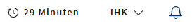

# LUX-Session-Timer



- [LUX-Session-Timer](#lux-session-timer)
  - [Overview / API](#overview--api)
    - [Allgemein](#allgemein)
    - [@Output](#output)
  - [Setup](#setup)
    - [1. Konfiguration](#1-konfiguration)
    - [2. Komponente einbinden](#2-komponente-einbinden)
  - [Beispiel](#beispiel)
    - [Vollständiges Beispiel](#vollständiges-beispiel)

## Overview / API

Die `lux-app-header-ac-session-timer`-Komponente zeigt die verbleibende Zeit der aktuellen Session an, öffnet automatisch einen Dialog, wenn die Session abzulaufen droht, und ermöglicht die Verlängerung der Session. Der Timer wird nur angezeigt, wenn die verbleibende Zeit weniger als eine Stunde ist. Wenn die verbleibende Zeit weniger als eine Minute ist, werden die restlichen Sekunden angezeigt. Der Session Timer bekommt die Zeit über einen Interceptor. Dieser reagiert auf den Header `X-Session-Time` in HTTP-Antworten und setzt den Timer auf den angegebenen Wert (in Sekunden).

### Allgemein

| Name     | Beschreibung                      |
| -------- | --------------------------------- |
| selector | `lux-app-header-ac-session-timer` |

### @Output

| Name           | Typ                   | Beschreibung                                                                                                                                   |
| -------------- | --------------------- | ---------------------------------------------------------------------------------------------------------------------------------------------- |
| luxLoginEvent  | Output Signal \<void> | Dieses Event wird ausgelöst, wenn im Dialog der "zum Login" Button geklickt wird. Damit soll der User direkt zur Login-Seite navigiert werden. |
| luxLogoutEvent | Output Signal \<void> | Dieses Event wird ausgelöst, wenn der User den Button "abmelden" betätigt. Der User soll dadurch einfach abgemeldet werden.                    |

### 1. Konfiguration

In der `app.config.ts` müssen die Endpunkte für den Session-Timer über den `LuxComponentsConfigModule` konfiguriert werden.

```typescript
// app.config.ts
const myConfiguration: LuxComponentsConfigParameters = {
  // ... andere Konfigurationen
  sessionTimerConfig: {
    url: '/api/session', // URL, die aufgerufen wird, wenn die Session verlängert werden soll. Ein Request wird nur gesendet, wenn die Session auch verlängert werden darf.
    // Optional:
    httpSessionTimeHeaderName: 'X-GfI-Session-Time', // Der Name des HTTP-Headers, aus dem die Session-Zeit ausgelesen wird. 'X-GfI-Session-Time' wird standardmäßig verwendet, wenn der Name des Headers abweicht, muss dieser Parameter gesetzt werden.
    httpSessionProlongationHeaderName: 'X-GfI-Session-Prolongation' // Dieser HTTP-Header wird genutzt, um zu entscheiden, ob die Session verlängert werden darf. Standardmäßig wird der Header 'X-GfI-Session-Prolongation' genutzt, wenn ein anderer Header genutzt wird, muss der Parameter gesetzt werden.
};

export const appConfig: ApplicationConfig = {
  providers: [
    // ... andere Konfigurationen
    provideHttpClient(withInterceptorsFromDi()),
    {
      provide: HTTP_INTERCEPTORS,
      useClass: LuxAppHeaderAcSessionTimerInterceptor,
      multi: true
    }
};
```

### 2. Komponente einbinden

Die Komponente wird im Menü des App-Headers angezeigt.

```html
<lux-app-header-ac>
  <lux-app-header-ac-action-nav>
    <lux-app-header-ac-session-timer
      (luxLoginEvent)="sharedService.login()"
      (luxLogoutEvent)="sharedService.logout(true)"
    ></lux-app-header-ac-session-timer>
  </lux-app-header-ac-action-nav>
</lux-app-header-ac>
```
