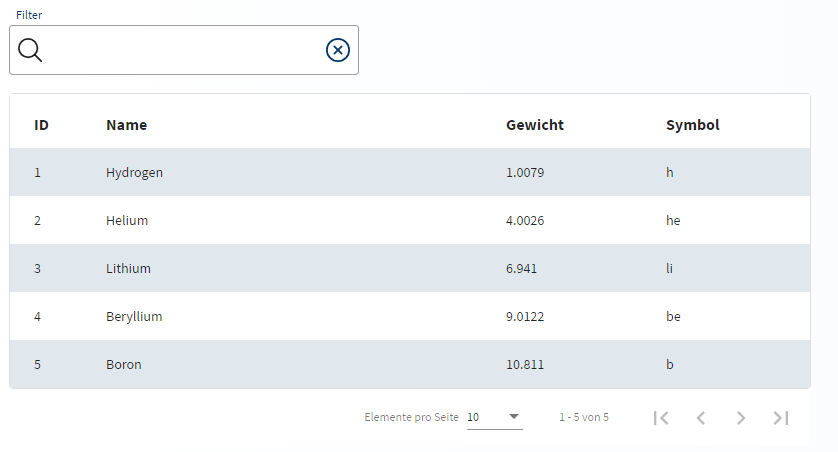
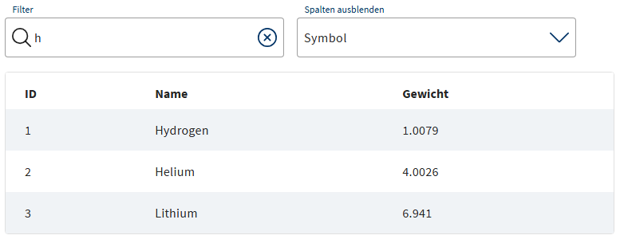

# LUX-Table



- [LUX-Table](#lux-table)
  - [Overview / API](#overview--api)
    - [Allgemein](#allgemein)
    - [@Input](#input)
    - [@Output](#output)
    - [@ViewChild](#viewchild)
  - [Components](#components)
    - [LuxTableColumnComponent](#luxtablecolumncomponent)
      - [Allgemein](#allgemein-1)
      - [@Input](#input-1)
    - [LuxTableColumnHeaderComponent](#luxtablecolumnheadercomponent)
      - [Allgemein](#allgemein-2)
      - [ng-content](#ng-content)
    - [LuxTableColumnContentComponent](#luxtablecolumncontentcomponent)
      - [Allgemein](#allgemein-3)
      - [ng-content](#ng-content-1)
    - [LuxTableColumnFooterComponent](#luxtablecolumnfootercomponent)
      - [Allgemein](#allgemein-4)
      - [ng-content](#ng-content-2)
  - [Beispiele](#beispiele)
    - [1. Simple Table](#1-simple-table)
    - [2. Filter und Spalten ausblenden](#2-filter-und-spalten-ausblenden)
    - [3. Pagination](#3-pagination)
    - [4. Sortable](#4-sortable)
    - [5. Filter, Pagination, Sortierung und angepassten Spaltenbreiten](#5-filter-pagination-sortierung-und-angepassten-spaltenbreiten)
    - [6. Custom CSS](#6-custom-css)
    - [7. Async Data](#7-async-data)
    - [8. Multiselect mit deaktivierten Checkboxen](#8-multiselect-mit-deaktivierten-checkboxen)
    - [9. Responsive](#9-responsive)
  - [Zusatzinformationen](#zusatzinformationen)
    - [Allgemein](#allgemein-5)

## Overview / API

### Allgemein

| Name     | Beschreibung |
| -------- | ------------ |
| selector | lux-table    |

### @Input

| Name                            | Typ                                   | Beschreibung                                                                                                                                                                                                                                                                                                                                                                                                    |
| ------------------------------- | ------------------------------------- | --------------------------------------------------------------------------------------------------------------------------------------------------------------------------------------------------------------------------------------------------------------------------------------------------------------------------------------------------------------------------------------------------------------- |
| luxData                         | any[]                                 | Enthält das Array mit den Datensätzen, welche in dieser Tabelle dargestellt werden sollen. Wird von der Komponente zu einem Objekt vom Typ MatTableDataSource umgewandelt. Ab der Version 1.5.9 reagiert die Tabelle auch auf Veränderungen an luxData.                                                                                                                                                         |
| luxHttpDAO                      | ILuxTableHttpDao                      | Alternative zu luxData, welche den asynchronen Abruf von Daten pro Page ermöglicht. Sollte die Funktion loadData(conf: { page: number, pageSize: number, filter?: string, sort?: string, order?: string}: Observable<{totalCount: number, items: any[]}> Das DAO kann das Interface ILuxTableHttpDao implementieren und die Funktion loadData den Rückgabetyp Observable \<ILuxTableHttpDaoStructure> besitzen. |
| luxColWidthsPercent             | number[]                              | Enthält ein Array mit Größenangaben in Prozent für die einzelnen Spalten in der Tabelle.                                                                                                                                                                                                                                                                                                                        |
| luxShowFilter                   | boolean                               | Bestimmt ob das Input-Feld für Filtereingaben dargestellt werden soll oder nicht. Der Filter berücksichtigt alle in der Tabelle bekannten Inhalte und Kopfzeilen.                                                                                                                                                                                                                                               |
| luxFilterText                   | string                                | Bestimmt den Text der als Platzhalter im Filter-Input angezeigt wird.                                                                                                                                                                                                                                                                                                                                           |
| luxShowPagination               | boolean                               | Bestimmt ob eine Pagination unterhalb der Tabelle angezeigt werden soll oder nicht.                                                                                                                                                                                                                                                                                                                             |
| luxPageSize                     | number                                | Bestimmt die Anzahl an Einträgen, die pro Pagination-Page für die Tabelle angezeigt werden.                                                                                                                                                                                                                                                                                                                     |
| luxPageSizeOptions              | number[]                              | Enthält das Array mit den vom Anwender auswählbaren Page-Sizes.                                                                                                                                                                                                                                                                                                                                                 |
| luxClasses                      | ICustomCSSConfig / ICustomCSSConfig[] | Enthält ein (optionales) Array mit Objekten vom Typ ICustomCSSConfig, welche eine CSS-Klasse als String sowie eine Funktion mit einer Bedingung beinhalten. (Siehe Beispiel 6)                                                                                                                                                                                                                                  |
| luxMinWidthPx                   | number                                | Bestimmt die Minimalbreite der Tabelle in PX, Voraussetzung dafür ist, das luxCalculateProportions den Wert "true" besitzt.                                                                                                                                                                                                                                                                                     |
| luxAutoPaginate                 | boolean                               | Bestimmt ob die Tabelle automatisch nach 100 Elementen die clientseitige Pagination aktiviert, um so die Ladezeiten zu verbessern und die Belastung durch das Rendern vieler Elemente zu verringern.                                                                                                                                                                                                            |
| luxMultiSelect                  | boolean                               | Bestimmt ob es sich bei dieser Tabelle um eine Multiselect-Tabelle handelt. Wenn ja, erhält jede Zeile eine Checkbox zum Auswählen des jeweiligen Eintrags sowie eine Checkbox zur Auswahl aller Elemente. Die Filterung wird bei luxMultiSelect-Tabellen automatisch aktiviert. Neue Selektionen werden vom EventEmitter luxSelectedChange publik gemacht.                                                     |
| luxMultiSelectOnlyCheckboxClick | boolean                               | Dieses Flag steuert, ob auch ein Klick auf die Zeile die Checkbox aktiviert oder ausschließlich ein Klick auf die Checkbox selbst. Dies kann nützlich sein, wenn die Tabelle auch Formularelemente (z.B. Textfelder) enthält, dann wird nicht bei einem Klick in das Textfeld auch die Checkbox aktiviert. <br><br> Erfordert `luxMultiSelect = true`.                                                          |
| luxMultiSelectDisabledProperty  | string                                | Ein Name für eine Boolean-Property. Der Wert dieser Property eines jeden Zeilenelements bestimmt, ob die zugehörige Checkbox deaktiviert ist. <br><br> Erfordert `luxMultiSelect = true`.                                                                                                                                                                                                                       |
| luxHideBorders                  | boolean                               | Ermöglicht es, die Borders dieser Tabelle auszublenden. Ansonsten wird die Tabelle wie gehabt aufgebaut und dargestellt.                                                                                                                                                                                                                                                                                        |
| luxSelected                     | Set \<T = any>                        | Ermöglicht es, programmatisch die selektierten Elemente in dieser Tabelle zu setzen. Voraussetzung dafür ist allerdings, dass das Feld luxMultiSelect den Wert true besitzt.                                                                                                                                                                                                                                    |
| luxCompareWith                  | Function                              | Wird von der Tabelle benutzt, um über luxSelected hereingereichte Werte mit den Werten aus der Tabelle zu vergleichen. Kann dazu benutzt werden, Objekte mit identischem Aufbau aber unterschiedlicher Referenz (z.B. weil sie vom Backend gekommen sind) zu vergleichen. Standardmäßig werden nur die Objektreferenzen miteinander verglichen.                                                                 |
| luxPickValue                    | Function                              | Kann dazu benutzt werden, spezielle Werte aus jedem Objekt der Tabelle zu lesen und für den Vergleich für die Selektion zu nutzen. Standardmäßig wird das Objekt selbst wieder zurückgegeben.                                                                                                                                                                                                                   |
| luxPagerDisabled                | boolean                               | Gibt an, ob der Pager deaktiviert ist.                                                                                                                                                                                                                                                                                                                                                                          |
| luxPagerTooltip                 | string                                | Tooltipp                                                                                                                                                                                                                                                                                                                                                                                                        |
| luxAlignTextTop                 | boolean                               | Alle Texte und Elemente werden oben ausgerichtet                                                                                                                                                                                                                                                                                                                                                                |
| luxShowColumnSelector           | boolean                               | Bestimmt, ob Spalten der Tabelle ausgeblendet werden können.                                                                                                                                                                                                                                                                                                                                          |
| luxColumnStorageKey             | string                                | Der Schlüssel unter dem die ausgeblendeten Spalten gespeichert werden.                                                                                                                                                                                                                                                                                                                                          |
| luxColumnVisibilityStore        | ILuxTableColumnVisibilityStore        | Wenn das Property nicht gefüllt wird, werden die ausgeblendeten Spalten im Browserspeicher (siehe _luxColumnStorageKey_) abgelegt. Wird eine individueller Store angegeben, wird dieser verwendet.                                                                                                                                                                                                              |

### @Output

| Name                     | Typ                                                            | Beschreibung                                                                                                                                                                                                                             |
| ------------------------ | -------------------------------------------------------------- | ---------------------------------------------------------------------------------------------------------------------------------------------------------------------------------------------------------------------------------------- |
| luxSelectedChange        | EventEmitter \<Set\<T = any>>                                  | Wird von Multiselect-Tabellen emittet und enthält ein Set mit allen selektierten Einträgen, die diese Tabelle aktuell besitzt.                                                                                                           |
| luxSelectedAsArrayChange | EventEmitter \<\<T = any>[]>                                   | Wird von Multiselect-Tabellen emittet und enthält ein Array mit allen selektierten Einträgen, die diese Tabelle aktuell besitzt.                                                                                                         |
| luxSingleClicked         | EventEmitter \<{ event: Event; rowItem: T, rowIndex: number }> | Wird emittet, wenn ein einfacher Mausklick (oder Enter oder Leertaste) auf eine Tabellenzeile ausgeführt wird. Anmerkung: Dieser Emitter wird ausschließlich für normale Tabellen (d.h. `luxMultiSelect` muss `false` sein) unterstützt. |
| luxDoubleClicked         | EventEmitter \<{ event: MouseEvent; rowItem: T }>              | Wird emittet, wenn ein Doppelklick auf eine Tabellenzeile ausgeführt wird. Anmerkung: Dieser Emitter wird ausschließlich für normale Tabellen (d.h. `luxMultiSelect` muss `false` sein) unterstützt.                                     |
| luxHiddenColumnsChange   | EventEmitter \<string[]>                                       | Wird emittet, wenn sich die ausgeblendeten Spalten ändern.                                                                                                                                                                               |

### @ViewChild

| Name            | Typ               | Beschreibung                       |
| --------------- | ----------------- | ---------------------------------- |
| filterComponent | LuxInputComponent | Die Component des Tabellenfilters. |

## Components

### LuxTableColumnComponent

#### Allgemein

| Name     | Beschreibung     |
| -------- | ---------------- |
| selector | lux-table-column |

#### @Input

| Name                   | Typ                        | Beschreibung                                                                                                                                                                                                                                                                                                                                          |
| ---------------------- | -------------------------- | ----------------------------------------------------------------------------------------------------------------------------------------------------------------------------------------------------------------------------------------------------------------------------------------------------------------------------------------------------- |
| luxConfigLabel         | string                     | Wird für das Select zum Ausblenden der Tabellenspalten verwendet.                                                                                                                                                                                                                                                                                     |
| luxColumnDef           | string                     | Enthält den Namen des Attributs welches für die Zellen in dieser Spalte verwendet werden soll. Muss innerhalb des Typs der einzelnen luxData-Objekte vorhanden sein. Beispiel: Bei luxData-Objekten vom Typ user { id, vorname, name } wären die möglichen luxColumnDefs "id", "vorname" und "name".                                                  |
| luxSortable            | boolean                    | Bestimmt ob diese Spalte auf- bzw. absteigend sortiert werden kann.                                                                                                                                                                                                                                                                                   |
| luxSticky              | boolean                    | Bestimmt ob die Zellen dieser Spalte an der linken oder rechten Seite oder überhaupt nicht fixiert werden. Tritt im Zusammenspiel mit einer Tabelle mit festgelegten Breiten (siehe luxTableContainerWidth und luxTableWidth) in Kraft. Mögliche Werte: 'start', 'end', 'none'                                                                        |
| luxResponsiveAt        | string \| string[] \| null | Bestimmt in welchen MediaQueries sich die Tabelle responsive verhalten soll. Hier kann ein einzelner Wert oder auch ein String-Array eingetragen werden. Mögliche Werte: 'xs', 'sm', 'md', 'lg', 'xl'                                                                                                                                                 |
| luxResponsiveBehaviour | string                     | Bestimmt das responsive-Verhalten der Spalte. Hier kann der Name (luxColumnDef) einer anderen Spalte eingetragen werden, dann werden die Inhalte dieser Spalte in die hier angegebene verschoben sobald die MediaQueries aus luxResponsiveAt zutreffen. Alternativ kann auch der Wert 'hide' eingetragen werden, dann wird diese Spalte ausgeblendet. |

### LuxTableColumnHeaderComponent

#### Allgemein

| Name     | Beschreibung            |
| -------- | ----------------------- |
| selector | lux-table-column-header |

#### ng-content

| Name        | Typ | Beschreibung                                                                                                          |
| ----------- | --- | --------------------------------------------------------------------------------------------------------------------- |
| ng-template |     | Template, welches für den Header eingesetzt werden muss. Hier kann dann z.B. der Titel für die Spalte gesetzt werden. |

### LuxTableColumnContentComponent

#### Allgemein

| Name     | Beschreibung             |
| -------- | ------------------------ |
| selector | lux-table-column-content |

#### ng-content

| Name        | Typ | Beschreibung                                                                                                                                                        |
| ----------- | --- | ------------------------------------------------------------------------------------------------------------------------------------------------------------------- |
| ng-template |     | Template für den Inhalt der einzelnen Zellen dieser Spalte. Es kann direkt an dem template auf die Referenz des jeweiligen Objekts dieser Zelle zugegriffen werden. |

### LuxTableColumnFooterComponent

#### Allgemein

| Name     | Beschreibung            |
| -------- | ----------------------- |
| selector | lux-table-column-footer |

#### ng-content

| Name        | Typ | Beschreibung                                                                                                                              |
| ----------- | --- | ----------------------------------------------------------------------------------------------------------------------------------------- |
| ng-template |     | Template, welches für den Footer eingesetzt werden muss. Hier kann dann z.B. eine zusätzliche Beschreibung für die Spalte gesetzt werden. |

## Beispiele

### 1. Simple Table


Ts

```typescript
dataSource: {position: number, name: string, weight: number, symbol: string}[] = [
  {position: 1, name: 'Hydrogen', weight: 1.0079, symbol: 'H'},
  {position: 2, name: 'Helium', weight: 4.0026, symbol: 'He'},
  {position: 3, name: 'Lithium', weight: 6.941, symbol: 'Li'},
  {position: 4, name: 'Beryllium', weight: 9.0122, symbol: 'Be'},
  {position: 5, name: 'Boron', weight: 10.811, symbol: 'B'}
];
```

Html

```html
<lux-table [luxData]="dataSource">
  <lux-table-column luxColumnDef="position">
    <lux-table-column-header
      ><ng-template>ID</ng-template></lux-table-column-header
    >
    <lux-table-column-content
      ><ng-template let-element
        >{{element.position}}</ng-template
      ></lux-table-column-content
    >
  </lux-table-column>
  <lux-table-column luxColumnDef="name">
    <lux-table-column-header
      ><ng-template>Name</ng-template></lux-table-column-header
    >
    <lux-table-column-content
      ><ng-template let-element
        >{{element.name}}</ng-template
      ></lux-table-column-content
    >
  </lux-table-column>
  <lux-table-column luxColumnDef="weight">
    <lux-table-column-header
      ><ng-template>Gewicht</ng-template></lux-table-column-header
    >
    <lux-table-column-content
      ><ng-template let-element
        >{{element.weight}}</ng-template
      ></lux-table-column-content
    >
  </lux-table-column>
  <lux-table-column luxColumnDef="symbol">
    <lux-table-column-header
      ><ng-template>Symbol</ng-template></lux-table-column-header
    >
    <lux-table-column-content
      ><ng-template let-element
        >{{element.symbol | lowercase}}</ng-template
      ></lux-table-column-content
    >
  </lux-table-column>
</lux-table>
```

### 2. Filter und Spalten ausblenden



Ts

```typescript
dataSource: {position: number, name: string, weight: number, symbol: string}[] = [
  {position: 1, name: 'Hydrogen', weight: 1.0079, symbol: 'H'},
  {position: 2, name: 'Helium', weight: 4.0026, symbol: 'He'},
  {position: 3, name: 'Lithium', weight: 6.941, symbol: 'Li'},
  {position: 4, name: 'Beryllium', weight: 9.0122, symbol: 'Be'},
  {position: 5, name: 'Boron', weight: 10.811, symbol: 'B'}
];
```

Html

```html
<lux-table 
  [luxData]="dataSource" 
  [luxShowFilter]="true"
  [luxShowColumnSelector]="true"
  luxColumnStorageKey="lux-demo-table-example">
  <lux-table-column luxColumnDef="position" luxConfigLabel="Position">
    <lux-table-column-header
      ><ng-template>ID</ng-template></lux-table-column-header
    >
    <lux-table-column-content
      ><ng-template let-element
        >{{element.position}}</ng-template
      ></lux-table-column-content
    >
  </lux-table-column>
  <lux-table-column luxColumnDef="name" luxConfigLabel="Name">
    <lux-table-column-header
      ><ng-template>Name</ng-template></lux-table-column-header
    >
    <lux-table-column-content
      ><ng-template let-element
        >{{element.name}}</ng-template
      ></lux-table-column-content
    >
  </lux-table-column>
  <lux-table-column luxColumnDef="weight" luxConfigLabel="Gewicht">
    <lux-table-column-header
      ><ng-template>Gewicht</ng-template></lux-table-column-header
    >
    <lux-table-column-content
      ><ng-template let-element
        >{{element.weight}}</ng-template
      ></lux-table-column-content
    >
  </lux-table-column>
  <lux-table-column luxColumnDef="symbol" luxConfigLabel="Symbol">
    <lux-table-column-header
      ><ng-template>Symbol</ng-template></lux-table-column-header
    >
    <lux-table-column-content
      ><ng-template let-element
        >{{element.symbol | lowercase}}</ng-template
      ></lux-table-column-content
    >
  </lux-table-column>
</lux-table>
```

### 3. Pagination


Ts

```typescript
dataSource: {position: number, name: string, weight: number, symbol: string}[] = [
  {position: 1, name: 'Hydrogen', weight: 1.0079, symbol: 'H'},
  {position: 2, name: 'Helium', weight: 4.0026, symbol: 'He'},
  {position: 3, name: 'Lithium', weight: 6.941, symbol: 'Li'},
  {position: 4, name: 'Beryllium', weight: 9.0122, symbol: 'Be'},
  {position: 5, name: 'Boron', weight: 10.811, symbol: 'B'}
];
```

Html

```html
<lux-table
  [luxData]="dataSource"
  [luxShowPagination]="true"
  [luxPageSize]="3"
  [luxPageSizeOptions]="[3, 5, 10]"
>
  <lux-table-column luxColumnDef="position">
    <lux-table-column-header
      ><ng-template>ID</ng-template></lux-table-column-header
    >
    <lux-table-column-content
      ><ng-template let-element
        >{{element.position}}</ng-template
      ></lux-table-column-content
    >
  </lux-table-column>
  <lux-table-column luxColumnDef="name">
    <lux-table-column-header
      ><ng-template>Name</ng-template></lux-table-column-header
    >
    <lux-table-column-content
      ><ng-template let-element
        >{{element.name}}</ng-template
      ></lux-table-column-content
    >
  </lux-table-column>
  <lux-table-column luxColumnDef="weight">
    <lux-table-column-header
      ><ng-template>Gewicht</ng-template></lux-table-column-header
    >
    <lux-table-column-content
      ><ng-template let-element
        >{{element.weight}}</ng-template
      ></lux-table-column-content
    >
  </lux-table-column>
  <lux-table-column luxColumnDef="symbol">
    <lux-table-column-header
      ><ng-template>Symbol</ng-template></lux-table-column-header
    >
    <lux-table-column-content
      ><ng-template let-element
        >{{element.symbol | lowercase}}</ng-template
      ></lux-table-column-content
    >
  </lux-table-column>
</lux-table>
```

### 4. Sortable


**Anmerkung**: Damit die Sortierung funktioniert, muss der Wert aus der `luxColumnDef`-Property mit dem Propertynamen des Elements übereinstimmen.
Z.B. `luxColumnDef="position"` und `{{element.position}}`. Wenn das keine Option ist, kann auch ein individueller Accessor angegeben werden.

Beispiel:

```typescript
  @ViewChild(LuxTableComponent) tableComponent!: LuxTableComponent;

  ngAfterViewInit() {
    (this.tableComponent.dataSource as LuxTableDataSource<MyRowElementType>).sortingDataAccessor =
      (element, luxColumnDef) => {
        switch (luxColumnDef) {
          case 'name':
            return element.fullname;
          default:
            return element[luxColumnDef];
        }
      };
  }
```

Ts

```typescript
dataSource: {position: number, name: string, weight: number, symbol: string}[] = [
  {position: 1, name: 'Hydrogen', weight: 1.0079, symbol: 'H'},
  {position: 2, name: 'Helium', weight: 4.0026, symbol: 'He'},
  {position: 3, name: 'Lithium', weight: 6.941, symbol: 'Li'},
  {position: 4, name: 'Beryllium', weight: 9.0122, symbol: 'Be'},
  {position: 5, name: 'Boron', weight: 10.811, symbol: 'B'}
];
```

Html

```html
<lux-table [luxData]="dataSource">
  <lux-table-column luxColumnDef="position" [luxSortable]="true">
    <lux-table-column-header
      ><ng-template>ID</ng-template></lux-table-column-header
    >
    <lux-table-column-content
      ><ng-template let-element
        >{{element.position}}</ng-template
      ></lux-table-column-content
    >
  </lux-table-column>
  <lux-table-column luxColumnDef="name" [luxSortable]="true">
    <lux-table-column-header
      ><ng-template>Name</ng-template></lux-table-column-header
    >
    <lux-table-column-content
      ><ng-template let-element
        >{{element.name}}</ng-template
      ></lux-table-column-content
    >
  </lux-table-column>
  <lux-table-column luxColumnDef="weight" [luxSortable]="true">
    <lux-table-column-header
      ><ng-template>Gewicht</ng-template></lux-table-column-header
    >
    <lux-table-column-content
      ><ng-template let-element
        >{{element.weight}}</ng-template
      ></lux-table-column-content
    >
  </lux-table-column>
  <lux-table-column luxColumnDef="symbol" [luxSortable]="true">
    <lux-table-column-header
      ><ng-template>Symbol</ng-template></lux-table-column-header
    >
    <lux-table-column-content
      ><ng-template let-element
        >{{element.symbol | lowercase}}</ng-template
      ></lux-table-column-content
    >
  </lux-table-column>
</lux-table>
```

### 5. Filter, Pagination, Sortierung und angepassten Spaltenbreiten


Ts

```typescript
colWidths = [10, 50, 20, 20];

dataSource: {position: number, name: string, weight: number, symbol: string}[] = [
  {position: 1, name: 'Hydrogen', weight: 1.0079, symbol: 'H'},
  {position: 2, name: 'Helium', weight: 4.0026, symbol: 'He'},
  {position: 3, name: 'Lithium', weight: 6.941, symbol: 'Li'},
  {position: 4, name: 'Beryllium', weight: 9.0122, symbol: 'Be'},
  {position: 5, name: 'Boron', weight: 10.811, symbol: 'B'}
];
```

Html

```html
<lux-table
  [luxData]="dataSource"
  [luxShowPagination]="true"
  [luxColWidthsPercent]="colWidths"
  [luxShowFilter]="true"
>
  <lux-table-column luxColumnDef="position" [luxSortable]="true">
    <lux-table-column-header
      ><ng-template>ID</ng-template></lux-table-column-header
    >
    <lux-table-column-content
      ><ng-template let-element
        >{{element.position}}</ng-template
      ></lux-table-column-content
    >
  </lux-table-column>
  <lux-table-column luxColumnDef="name" [luxSortable]="true">
    <lux-table-column-header
      ><ng-template>Name</ng-template></lux-table-column-header
    >
    <lux-table-column-content
      ><ng-template let-element
        >{{element.name}}</ng-template
      ></lux-table-column-content
    >
  </lux-table-column>
  <lux-table-column luxColumnDef="weight" [luxSortable]="true">
    <lux-table-column-header
      ><ng-template>Gewicht</ng-template></lux-table-column-header
    >
    <lux-table-column-content
      ><ng-template let-element
        >{{element.weight}}</ng-template
      ></lux-table-column-content
    >
  </lux-table-column>
  <lux-table-column luxColumnDef="symbol" [luxSortable]="true">
    <lux-table-column-header
      ><ng-template>Symbol</ng-template></lux-table-column-header
    >
    <lux-table-column-content
      ><ng-template let-element
        >{{element.symbol | lowercase}}</ng-template
      ></lux-table-column-content
    >
  </lux-table-column>
</lux-table>
```

### 6. Custom CSS


Ts

```typescript
dataSource: {position: number, name: string, weight: number, symbol: string}[] = [
  {position: 1, name: 'Hydrogen', weight: 1.0079, symbol: 'H'},
  {position: 2, name: 'Helium', weight: 4.0026, symbol: 'He'},
  {position: 3, name: 'Lithium', weight: 6.941, symbol: 'Li'},
  {position: 4, name: 'Beryllium', weight: 9.0122, symbol: 'Be'},
  {position: 5, name: 'Boron', weight: 10.811, symbol: 'B'}
];

tableCSS: ICustomCSSConfig[] = [
  {
    class: 'demo-pos-until-3', check(element): boolean {
      return element.position < 3
    }
  },
  {
    class: 'demo-weight-above-5', check(element): boolean {
      return element.weight > 5
    }
  }
];
```

SCSS

```scss
:host ::ng-deep .demo-pos-until-3 {
  background: rgba(46, 84, 125, 0.5) !important;
}
:host ::ng-deep .demo-weight-above-5 {
  background: rgba(209, 174, 194, 0.5) !important;
}
```

Html

```html
<lux-table [luxData]="dataSource" [luxClasses]="tableCSS">
  <lux-table-column luxColumnDef="position" [luxSortable]="true">
    <lux-table-column-header
      ><ng-template>ID</ng-template></lux-table-column-header
    >
    <lux-table-column-content
      ><ng-template let-element
        >{{element.position}}</ng-template
      ></lux-table-column-content
    >
  </lux-table-column>
  <lux-table-column luxColumnDef="name">
    <lux-table-column-header
      ><ng-template>Name</ng-template></lux-table-column-header
    >
    <lux-table-column-content
      ><ng-template let-element
        >{{element.name}}</ng-template
      ></lux-table-column-content
    >
  </lux-table-column>
  <lux-table-column luxColumnDef="weight">
    <lux-table-column-header
      ><ng-template>Gewicht</ng-template></lux-table-column-header
    >
    <lux-table-column-content
      ><ng-template let-element
        >{{element.weight}}</ng-template
      ></lux-table-column-content
    >
  </lux-table-column>
  <lux-table-column luxColumnDef="symbol" [luxSortable]="true">
    <lux-table-column-header
      ><ng-template>Symbol</ng-template></lux-table-column-header
    >
    <lux-table-column-content
      ><ng-template let-element
        >{{element.symbol | lowercase}}</ng-template
      ></lux-table-column-content
    >
  </lux-table-column>
</lux-table>
```

### 7. Async Data


TestHTTPDAO.ts

```typescript
export class TestHTTPDAO implements ILuxTableHttpDao {
  dataSource: any[] = [
    { position: 1, name: "Hydrogen", weight: 1.0079, symbol: "H" },
    { position: 2, name: "Helium", weight: 4.0026, symbol: "He" },
    { position: 3, name: "Lithium", weight: 6.941, symbol: "Li" },
    { position: 4, name: "Beryllium", weight: 9.0122, symbol: "Be" },
    { position: 5, name: "Boron", weight: 10.811, symbol: "B" },
    { position: 6, name: "Carbon", weight: 12.0107, symbol: "C" },
    { position: 7, name: "Nitrogen", weight: 14.0067, symbol: "N" },
    { position: 8, name: "Oxygen", weight: 15.9994, symbol: "O" },
    { position: 9, name: "Fluorine", weight: 18.9984, symbol: "F" },
    { position: 10, name: "Neon", weight: 20.1797, symbol: "Ne" },
    { position: 11, name: "Sodium", weight: 22.9897, symbol: "Na" },
    { position: 12, name: "Magnesium", weight: 24.305, symbol: "Mg" },
    { position: 13, name: "Aluminum", weight: 26.9815, symbol: "Al" },
    { position: 14, name: "Silicon", weight: 28.0855, symbol: "Si" },
    { position: 15, name: "Phosphorus", weight: 30.9738, symbol: "P" },
    { position: 16, name: "Sulfur", weight: 32.065, symbol: "S" },
  ];

  constructor() {}

  loadData(conf: {
    page: number;
    pageSize: number;
    filter?: string;
    sort?: string;
    order?: string;
  }): Observable<any> {
    // nur ein gemocktes Beispiel
    // bis zum return wuerde das alles hier serverseitig stattfinden
    let start = conf.page * (conf.pageSize * 1);
    let end = start + conf.pageSize * 1;

    let tempDataSourceFix = this.dataSource.slice(0, this.dataSource.length);
    if (
      tempDataSourceFix.length > 0 &&
      conf.sort &&
      tempDataSourceFix[0][conf.sort]
    ) {
      tempDataSourceFix = tempDataSourceFix.sort((a, b) => {
        if (conf.order === "asc") {
          return a[conf.sort!] > b[conf.sort!] ? -1 : 1;
        } else if (conf.order === "desc") {
          return b[conf.sort!] > a[conf.sort!] ? -1 : 1;
        }
        return 0;
      });
    }

    if (conf.filter) {
      conf.filter = conf.filter.toLocaleLowerCase();
      tempDataSourceFix = tempDataSourceFix.filter(
        (el: any) =>
          ("" + el.position).indexOf(conf.filter!) > -1 ||
          el.name.toLowerCase().indexOf(conf.filter) > -1 ||
          ("" + el.weight).indexOf(conf.filter!) > -1 ||
          el.symbol.toLowerCase().indexOf(conf.filter) > -1,
      );
    }

    let result = tempDataSourceFix.slice(start, end);
    return of({ items: result, totalCount: tempDataSourceFix.length }).pipe(
      delay(2000),
    );
  }
}
```

Ts

```typescript
colWidths = [10, 50, 20, 20];

httpDAO = new TestHTTPDAO();
```

Html

```html
<lux-table
  [luxShowPagination]="true"
  [luxColWidthsPercent]="colWidths"
  [luxShowFilter]="true"
  [luxPageSize]="5"
  [luxHttpDAO]="httpDAO"
>
  <lux-table-column luxColumnDef="position" [luxSortable]="true">
    <lux-table-column-header
      ><ng-template>ID</ng-template></lux-table-column-header
    >
    <lux-table-column-content
      ><ng-template let-element
        >{{element.position}}</ng-template
      ></lux-table-column-content
    >
  </lux-table-column>
  <lux-table-column luxColumnDef="name">
    <lux-table-column-header
      ><ng-template>Name</ng-template></lux-table-column-header
    >
    <lux-table-column-content
      ><ng-template let-element
        >{{element.name}}</ng-template
      ></lux-table-column-content
    >
  </lux-table-column>
  <lux-table-column luxColumnDef="weight">
    <lux-table-column-header
      ><ng-template>Gewicht</ng-template></lux-table-column-header
    >
    <lux-table-column-content
      ><ng-template let-element
        >{{element.weight}}</ng-template
      ></lux-table-column-content
    >
  </lux-table-column>
  <lux-table-column luxColumnDef="symbol">
    <lux-table-column-header
      ><ng-template>Symbol</ng-template></lux-table-column-header
    >
    <lux-table-column-content
      ><ng-template let-element
        >{{element.symbol | lowercase}}</ng-template
      ></lux-table-column-content
    >
  </lux-table-column>
</lux-table>
```

### 8. Multiselect mit deaktivierten Checkboxen


Ts

```typescript
  mySelected: Set<{position: number, name: string, weight: number, symbol: string, disabled?: boolean}>= new Set();
  mySelectedArr: {position: number, name: string, weight: number, symbol: string, disabled?: boolean}[] = [];

  dataSource: {position: number, name: string, weight: number, symbol: string, disabled?: boolean}[] = [
    {position: 1, name: 'Hydrogen', weight: 1.0079, symbol: 'H', disabled: true},
    {position: 2, name: 'Helium', weight: 4.0026, symbol: 'He', disabled: false},
    {position: 3, name: 'Lithium', weight: 6.941, symbol: 'Li', disabled: false},
    {position: 4, name: 'Beryllium', weight: 9.0122, symbol: 'Be', disabled: false},
    {position: 5, name: 'Boron', weight: 10.811, symbol: 'B', disabled: false}
  ];

  onArray(selected: {position: number, name: string, weight: number, symbol: string, disabled?: boolean}[]) {
    this.mySelectedArr = selected;
  }
```

Html

```html
<lux-table
  [luxShowPagination]="true"
  [luxMultiSelect]="true"
  luxMultiSelectDisabledProperty="disabled"
  (luxSelectedAsArrayChange)="onArray($event)"
  (luxSelectedChange)="mySelected = $event"
  [luxData]="dataSource"
>
  <lux-table-column luxColumnDef="position">
    <lux-table-column-header
      ><ng-template>ID</ng-template></lux-table-column-header
    >
    <lux-table-column-content
      ><ng-template let-element
        >{{element.position}}</ng-template
      ></lux-table-column-content
    >
    <lux-table-column-footer
      ><ng-template>Position Footer</ng-template></lux-table-column-footer
    >
  </lux-table-column>
  <lux-table-column luxColumnDef="name">
    <lux-table-column-header
      ><ng-template>Name</ng-template></lux-table-column-header
    >
    <lux-table-column-content
      ><ng-template let-element
        >{{element.name}}</ng-template
      ></lux-table-column-content
    >
    <lux-table-column-footer
      ><ng-template>Name Footer</ng-template></lux-table-column-footer
    >
  </lux-table-column>
  <lux-table-column luxColumnDef="weight">
    <lux-table-column-header>Gewicht</lux-table-column-header>
    <lux-table-column-content
      ><ng-template let-element
        >{{element.weight}}</ng-template
      ></lux-table-column-content
    >
    <lux-table-column-footer
      ><ng-template>Gewicht Footer</ng-template></lux-table-column-footer
    >
  </lux-table-column>
  <lux-table-column luxColumnDef="symbol">
    <lux-table-column-header
      ><ng-template>Symbol</ng-template></lux-table-column-header
    >
    <lux-table-column-content
      ><ng-template let-element
        >{{element.symbol | lowercase}}</ng-template
      ></lux-table-column-content
    >
    <lux-table-column-footer
      ><ng-template>Symbol Footer</ng-template></lux-table-column-footer
    >
  </lux-table-column>
</lux-table>
```

### 9. Responsive

In der Media-Query "md":


In der Media-Query "sm":


Ts

```typescript
dataSource: {position: number, name: string, weight: number, symbol: string}[] = [
  {position: 1, name: 'Hydrogen', weight: 1.0079, symbol: 'H'},
  {position: 2, name: 'Helium', weight: 4.0026, symbol: 'He'},
  {position: 3, name: 'Lithium', weight: 6.941, symbol: 'Li'},
  {position: 4, name: 'Beryllium', weight: 9.0122, symbol: 'Be'},
  {position: 5, name: 'Boron', weight: 10.811, symbol: 'B'}
];
```

Html

```html
<lux-table [luxData]="dataSource">
  <lux-table-column luxColumnDef="position">
    <lux-table-column-header
      ><ng-template>ID</ng-template></lux-table-column-header
    >
    <lux-table-column-content
      ><ng-template let-element
        >{{element.position}}</ng-template
      ></lux-table-column-content
    >
  </lux-table-column>
  <lux-table-column
    luxColumnDef="name"
    [luxResponsiveAt]="['xs', 'sm']"
    luxResponsiveBehaviour="weight"
  >
    <lux-table-column-header
      ><ng-template>Name</ng-template></lux-table-column-header
    >
    <lux-table-column-content
      ><ng-template let-element
        >{{element.name}}</ng-template
      ></lux-table-column-content
    >
  </lux-table-column>
  <lux-table-column luxColumnDef="weight">
    <lux-table-column-header
      ><ng-template>Gewicht</ng-template></lux-table-column-header
    >
    <lux-table-column-content
      ><ng-template let-element
        >{{element.weight}}</ng-template
      ></lux-table-column-content
    >
  </lux-table-column>
  <lux-table-column
    luxColumnDef="symbol"
    [luxResponsiveAt]="['xs', 'sm']"
    luxResponsiveBehaviour="hide"
  >
    <lux-table-column-header
      ><ng-template>Symbol</ng-template></lux-table-column-header
    >
    <lux-table-column-content
      ><ng-template let-element
        >{{element.symbol | lowercase}}</ng-template
      ></lux-table-column-content
    >
  </lux-table-column>
</lux-table>
```

## Zusatzinformationen

### Allgemein

Eine Tabellen-Komponente zur Darstellung von mehreren Datensätzen in einer einfachen und kompakten Darstellung.
Bietet Optionen zum Filtern, der Pagination sowie der Sortierung von Datensätzen an.

Die Zellen der Tabelle werden mithilfe der Komponenten LuxTableColumnComponent, LuxTableColumnHeaderComponent und LuxTableColumnContentComponent erstellt.

IE-11: Bitte beachten, das der IE-11 keine Sticky-Positionierungen erlaubt. Aufgrund der bereits bestehenden Komplexität der Komponente wurde darauf verzichtet speziell für den IE einen Workaround für Sticky Header- und Footer-Elemente zu erstellen.
