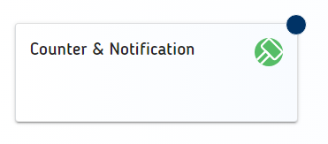

# LUX-Tile


- [LUX-Tile](#lux-tile)
  - [Overview / API](#overview--api)
    - [Allgemein](#allgemein)
    - [@Input](#input)
    - [@Output](#output)
  - [Styleguide](#styleguide)
  - [Beispiele](#beispiele)
    - [1. Kachel mit Icon](#1-kachel-mit-icon)
    - [2. Kachel mit Bild](#2-kachel-mit-bild)
    - [3. Kachel mit Marker](#3-kachel-mit-marker)
    - [4. Kachel mit Zahl](#4-kachel-mit-zahl)

## Overview / API

### Allgemein

| Name     | Beschreibung |
| -------- | ------------ |
| selector | lux-tile-ac  |

### @Input

| Name                             | Typ     | Beschreibung                                                                                                                                                   |
| -------------------------------- | ------- | -------------------------------------------------------------------------------------------------------------------------------------------------------------- |
| luxLabel                         | string  | Enthält das Label, welches oben im Tile angezeigt wird.                                                                                                        |
| luxLabelTruncateAfterOneLine     | boolean | Gibt an, ob das _luxLabel_ nach der ersten Zeile abgeschnitten wird.                                                                                           |
| luxLabelTruncateAfterTwoLine     | boolean | Gibt an, ob das _luxLabel_ nach der zweiten Zeile abgeschnitten wird.                                                                                          |
| luxSubTitle                      | string  | Enthält den Untertitel, welches unten im Tile angezeigt wird.                                                                                                  |
| luxSubTitleTruncateAfterOneLine  | boolean | Gibt an, ob das _luxLabel_ nach der ersten Zeile abgeschnitten wird.                                                                                           |
| luxSubTitleTruncateAfterTwoLines | boolean | Gibt an, ob das _luxLabel_ nach der zweiten Zeile abgeschnitten wird.                                                                                          |
| luxTagId                         | string  | [LUX-Tag-Id](luxTagId-v21#direkte-konfiguration) für die automatischen Tests.                                                                                  |
| luxCounter                       | number  | Zeigt eine Zahl auf der rechten, oberen Seite des Tiles an.                                                                                                    |
| luxCounterCap                    | number  | Die Obergrenze für den luxCounter. Wenn der luxCounter größer als der luxCounterCap ist, wird der luxCounterCap mit einem zusätzlichen '+'-Symbol dargestellt. |
| luxShowNotification              | boolean | Bestimmt ob das Symbol für Notifikationen an der rechten, oberen Seite des Tiles dargestellt wird.                                                             |

### @Output

| Name       | Typ                   | Beschreibung                                               |
| ---------- | --------------------- | ---------------------------------------------------------- |
| luxClicked | EventEmitter \<Event> | Event das ausgestoßen wird, wenn das Tile angeklickt wird. |

## Styleguide

Grundlegende Regeln zum Umgang mit Tile's sind:

- Die Überschriften bei den Tile's sind analog zur lux-card grundsätzlich links auszurichten.

## Beispiele

### 1. Kachel mit Icon


Html

```html
<lux-tile-ac luxLabel="Kalender" class="lux-min-width-60 lux-min-height-28">
  <lux-icon luxIconName="lux-interface-calendar"></lux-icon>
</lux-tile-ac>
```

### 2. Kachel mit Bild


Html

```html
<lux-tile-ac luxLabel="Bild">
  <lux-image
    luxImageSrc="assets/svg/Example.svg"
    luxImageWidth="100%"
    luxImageHeight="100%"
  ></lux-image>
</lux-tile-ac>
```

### 3. Kachel mit Marker



Html

```html
<lux-tile-ac
  luxLabel="Counter & Notification"
  class="lux-min-width-80 lux-min-height-28"
  [luxShowNotification]="true"
>
  <lux-icon
    luxIconName="lux-interface-setting-hammer"
    luxColor="green"
    [luxRounded]="true"
  ></lux-icon>
</lux-tile-ac>
```

### 4. Kachel mit Zahl


Html

```html
<lux-tile-ac
  luxLabel="Counter & Notification"
  class="lux-min-width-80 lux-min-height-28"
  [luxCounter]="20"
  [luxCounterCap]="15"
>
  <lux-icon
    luxIconName="lux-interface-setting-hammer"
    luxColor="green"
    [luxRounded]="true"
  ></lux-icon>
</lux-tile-ac>
```
