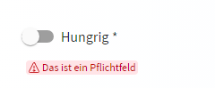

# LUX-Toggle


- [LUX-Toggle](#lux-toggle)
  - [Overview / API](#overview--api)
    - [Allgemein](#allgemein)
    - [@Input](#input)
    - [@Output](#output)
  - [Beispiele](#beispiele)
    - [1. Ohne Formular](#1-ohne-formular)
    - [2. Mit Two-Way-Binding](#2-mit-two-way-binding)
    - [3. Mit Formular](#3-mit-formular)

## Overview / API

### Allgemein

| Name     | Beschreibung  |
| -------- | ------------- |
| selector | lux-toggle-ac |

### @Input

| Name                   | Typ                    | Beschreibung                                                                                                                                                                                                                                                                                                               |
| ---------------------- | ---------------------- | -------------------------------------------------------------------------------------------------------------------------------------------------------------------------------------------------------------------------------------------------------------------------------------------------------------------------- |
| luxChecked             | boolean                | Beschreibt den Zustand der Component (true = checked, false = unchecked). Two-Way-Binding ebenfalls möglich, wenn die Component nicht innerhalb eines Formulars verwendet wird.                                                                                                                                            |
| luxTagId               | string                 | [LUX-Tag-Id](luxTagId-v21#direkte-konfiguration) für die automatischen Tests.                                                                                                                                                                                                                                              |
| luxPlaceholder         | string                 | Text der als Platzhalter, solange kein anderer Wert eingetragen ist, dargestellt wird.                                                                                                                                                                                                                                     |
| luxAutocomplete        | string                 | Steuert, ob der Browser den Inhalt cachen darf.                                                                                                                                                                                                                                                                            |
| luxRequired            | boolean                | Bestimmt ob die Component ein Pflichtfeld ist oder nicht.                                                                                                                                                                                                                                                                  |
| luxControlBinding      | string                 | Das Controlbinding (z.B. firstname) verbindet das Formularelement mit einem Wert aus dem Modell. (!) Diese Eigenschaft kann nur verwendet werden, wenn das Element innerhalb eines Formulars verwendet wird.                                                                                                               |
| luxErrorMessage        | string                 | Fehlertext, wenn das Formularelement nicht valide ist. Der Fehlertext ersetzt den Hinweistext, wenn es einen gibt. Ersetzt den luxErrorCallback, wenn gesetzt.                                                                                                                                                             |
| luxDisabled            | boolean                | Bestimmt ob die Component deaktiviert ist oder nicht. Durch den Event-Emitter "luxDisabledChange" ist ein Two-Way-Binding möglich.                                                                                                                                                                                         |
| luxReadonly            | boolean                | Bestimmt ob sich das Feld im reinen Lese-Zustand befindet (ähnlich wie disabled, aber ohne die Auswirkungen auf Forms und andere visuelle Darstellung).                                                                                                                                                                    |
| luxErrorCallback       | LuxErrorCallbackFnType | Callback-Funktion die aufgerufen wird nachdem die Validierung der Component stattgefunden hat. Hier kann dann entsprechend aus dem übergebenen Errors-Objekt ein Fehler ausgelesen und die passende Fehlermeldung zurückgegeben werden. Liefert der Callback `undefined` zurück, wird die Defaultfehlermeldung ausgegeben. |
| luxControlValidators   | ValidatorFnType        | Validator-Funktion oder ein Array von Validator-Funktionen, die für diese Component hereingereicht werden können. Diese werden nur für nicht-ReactiveForms-Components angewendet und sollen so eine Validierung für "normale" Komponenten ermöglichen.                                                                     |
| luxLabel               | string                 | Property welche ein Label oberhalb der FormComponent (Ausnahme: LuxToggle und LuxCheckbox, diese stellen das Label rechts von der Schaltfläche dar) darstellt.                                                                                                                                                             |
| luxHint                | string                 | Property, welche einen Tipp/Text unterhalb der FormComponent darstellt. Alternativ kann man über das Content-Child `lux-form-hint` komplexere Hinweise (z.B. mit einem Link) darstellen.                                                                                                                                   |
| luxHintShowOnlyOnFocus | boolean                | Gibt an, ob der Hinweis (siehe luxHint) nur angezeigt wird, wenn das Element den Fokus hat.                                                                                                                                                                                                                                |
| luxLabelLongFormat     | boolean                | Bestimmt, ob das Label mehrzeilig sein kann. Nutzung nur in Spalten empfohlen, da die Höhe des Formcontrols variieren kann. Dadurch kann die Ausrichtung an der Baseline nicht mehr gewährleistet werden.                                                                                                                  |
| luxNoLabels            | boolean                | Gibt an, ob Labels angezeigt werden sollen.                                                                                                                                                                                                                                                                                |
| luxNoTopLabel          | boolean                | Gib an, ob das obere Label angezeigt werden soll.                                                                                                                                                                                                                                                                          |
| luxNoBottomLabel       | boolean                | Gibt an, ob das untere Label (Hinweis oder Fehlermeldung) angezeigt werden soll.                                                                                                                                                                                                                                           |
| luxDense               | boolean                | Property um die Höhe der Komponente zu verringern. Diese Eigenschaft ist für den Einsatz in großen Formularen gedacht und soll nicht standardmäßig in einer Anwendung genutzt werden.                                                                                                                                      |

### @Output

| Name              | Typ                        | Beschreibung                                                                                                                     |
| ----------------- | -------------------------- | -------------------------------------------------------------------------------------------------------------------------------- |
| luxCheckedChange  | EventEmitter \<boolean>    | Output-Event welches ausgelöst wird, sobald sich der Checked-Zustand geändert hat. Ermöglicht das Two-Way-Binding an luxChecked. |
| luxFocusIn        | EventEmitter \<FocusEvent> | Event welches beim Fokussieren des Elements ausgelöst wird und ein Objekt vom Typ FocusEvent weitergibt.                         |
| luxFocusOut       | EventEmitter \<FocusEvent> | Event welches beim Fokusverlust des Elements ausgelöst wird und ein Objekt vom Typ FocusEvent weitergibt.                        |
| luxDisabledChange | EventEmitter \<boolean>    | Event welches beim Disablen des Elements ausgelöst wird.                                                                         |

## Beispiele

### 1. Ohne Formular


Ts

```typescript
checked: boolean = true;

onCheckedChange($event: boolean) {
    console.log($event);
}
```

Html

```html
<lux-toggle-ac
  luxLabel="Hungrig"
  [luxChecked]="checked"
  (luxCheckedChange)="onCheckedChange($event)"
></lux-toggle-ac>
```

### 2. Mit Two-Way-Binding


Ts

```typescript
checked: boolean = true;
```

Html

```html
<lux-toggle-ac luxLabel="Hungrig" [(luxChecked)]="checked"></lux-toggle-ac>
```

### 3. Mit Formular



Ts

```typescript
myGroup: FormGroup;
constructor() {
    this.myGroup = new FormGroup({
      hungry: new FormControl<boolean>(false, Validators.requiredTrue)
    });
}
```

Html

```html
<form [formGroup]="myGroup">
  <lux-toggle-ac luxLabel="Hungrig" luxControlBinding="hungry"></lux-toggle-ac>
</form>
```
